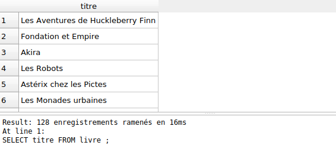
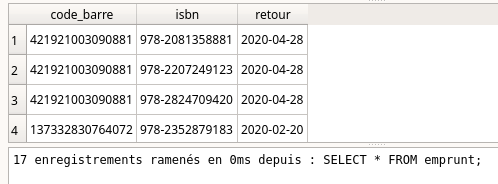
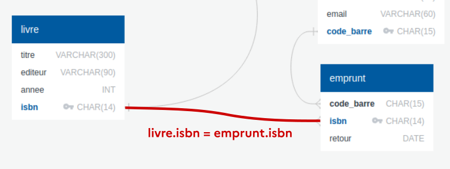

# Langage SQL

{: .center width=40%}


## 0. Du modèle relationnel au SGBD
Les considérations sur le modèle relationnel traitaient plutôt de la structure mathématique des données. 

Il s'agissait de déterminer la meilleure structure pour représenter les données et les relations qui les lient. 

Il convient maintenant d'aborder la partie logicielle : les SGBD (Systèmes de Gestion de Bases de Données).

Les SGBD jouent le rôle d'interface entre l'être humain et la base de données.
Par l'intermédiaire de **requêtes**, l'utilisateur va consulter ou modifier la base de données. Le SGBD est garant de l'intégrité de cette base, et prévient notamment que les modifications (souvent appelées **transactions**) ne soient pas préjudiciables à la base de données.

Le langage utilisé pour communiquer avec le SGBD est le langage **SQL**, pour Structured  Query Langage (pour *langage de requêtes structurées*).

Les SGBD les plus utilisés sont basés sur le modèle relationnel. Parmi eux, citons Oracle, MySQL, Microsoft SQL Server, PostgreSQL, Microsoft Access, SQLite, MariaDB...

Mais de plus en plus de SGBD **non-relationnels** sont utilisés, spécialement adaptés à des données plus diverses et moins structurées. On les retrouve sous l'appelation **NoSQL**  (pour *Not only SQL*). Citons parmi eux MongoDB, Cassandra (Facebook), BigTable (Google)...


## 1. Introduction au langage SQL


Dans toute la suite, nous allons travailler avec la base de données ```livres.db```.

### 1.0 Différents moyens d'interroger la base de données
**Pré-requis :** téléchargez la base de données [livres.db](data/livres.db).

??? abstract "1. En ligne avec ```sqliteonline.com``` "
    - Rendez vous sur [https://sqliteonline.com/](https://sqliteonline.com/)
    - Par File / OpenDB, ouvrez le fichier  ```livres.db``` précédemment téléchargé.
    - Écrivez votre requête plus cliquez sur Run.  
    


!!! abstract "2. Directement sur ce site"
    - Rendez vous sur la page [SQL en ligne](../sqlenligne/){. target="_blank"}
    []()
    - Écrivez la requête dans le champ prévu pour votre base.


--------

Dans toute la suite, les manipulations sont à faire en interrogeant la base de données ```livres.db```, avec l'une des méthodes indiquées ci-dessus.

Voici le diagramme relationnel de cette base :
{: .center}


- les clés primaires sont en bleu (suivi d'une icone de clé)
- les clés étrangères sont en noir et reliées à leur clé primaire.

<!-- diagramme réalisé depuis https://app.quickdatabasediagrams.com/
.db -> .sql fait avec DBbrowser -->


### 1.1. Sélection de données

#### 1.1.0 Exemple 0 

!!! note "Requête basique : SELECT, FROM :heart:"
    - **Commande :** 
    ```sql
    SELECT titre FROM livre ;
    ``` 
    - **Traduction :** 

    On veut tous les titres de la table «livre».

    - **Résultat :**   

    

**Remarques**  

- Les mots-clés SQL sont traditionnellement écrits en MAJUSCULES. 
{: .center width=40%}

- Le ```;``` signale la fin de l'instruction. Il peut donc être omis s'il n'y a pas d'instructions enchaînées (ce qui sera toujours notre cas).  

- L'indentation n'est pas syntaxique (pas comme en Python). On peut faire des retours à la ligne et des indentations pour rendre le code plus lisible.


#### 1.1.1 Exemple 1 

!!! note "Requête filtrée : SELECT, FROM, WHERE :heart:"
    - **Commande :** 
    ```sql
    SELECT titre 
    FROM livre 
    WHERE annee >= 1990;
    ``` 
    - **Traduction :** 

    On veut les titres de la table «livre» qui sont parus après (ou en ) 1990;

    - **Résultat :**   

    


Le mot-clé WHERE doit être suivi d'un booléen. Les opérateurs classiques ```=``` , ```!=```, ```>```, ```>=```, ```<```, ```<=``` peuvent être utilisés, mais aussi le mot-clé IN :
#### 1.1.1bis Exemple 1bis 

!!! note "Requête avec plusieurs possibilités : WHERE ... IN... :heart:"
    - **Commande :** 
    ```sql
    SELECT titre 
    FROM livre 
    WHERE annee IN (1990, 1991, 1992);
    ``` 
    - **Traduction :** 

    On veut les titres de la table «livre» qui sont parus en 1990, 1991 ou 1992.

    - **Résultat :**   

    


#### 1.1.2 Exemple 2 

!!! note "Requête avec booléens : AND - OR :heart:"
    - **Commande :** 
    ```sql
    SELECT titre 
    FROM livre 
    WHERE  annee >= 1970 AND annee <= 1980 AND editeur = 'Dargaud';
    ``` 
    - **Traduction :** 

    On veut les titres de la table «livre» qui sont parus entre 1970 et 1980 chez l'éditeur Dargaud;

    - **Résultat :**   

    


#### 1.1.3 Exemple 3 

!!! note "Requête approchée : LIKE :heart:"
    - **Commande :** 
    ```sql
    SELECT titre 
    FROM livre 
    WHERE titre LIKE '%Astérix%';
    ``` 
    - **Traduction :** 

    On veut les titres de la table «livre» dont le titre contient la chaîne de caractères "Astérix".  
    Le symbole ```%``` est un joker qui peut symboliser n'importe quelle chaîne de caractères. 

    - **Résultat :**   

    

#### 1.1.4 Exemple 4 

!!! note "Plusieurs colonnes :heart:"
    - **Commande :** 
    ```sql
    SELECT titre, isbn 
    FROM livre 
    WHERE annee >= 1990;
    ``` 
    - **Traduction :** 

    On veut les titres et les ISBN de la table «livre» qui sont parus après 1990.

    - **Résultat :**   

    

#### 1.1.5 Exemple 5 

!!! note "Toutes les colonnes : * :heart:"
    - **Commande :** 
    ```sql
    SELECT * 
    FROM livre 
    WHERE annee >= 1990;
    ``` 
    - **Traduction :** 

    On veut toutes les colonnes disponibles de la table «livre» pour les livres qui sont parus après 1990.  
    L'astérisque ```*``` est un joker (*wildcard* en anglais).

    - **Résultat :**   

    

#### 1.1.6 Exemple 6 

!!! note "Renommer les colonnes : AS :heart:"
    - **Commande :** 
    ```sql
    SELECT titre AS titre_du_livre 
    FROM livre 
    WHERE annee >= 1990;
    ``` 
    - **Traduction :** 

    Lors de l'affichage du résulats et dans la suite de la requête (important), la colonne "titre" est renommée "titre_du_livre".

    - **Résultat :**   

    

**Remarque**  
L'alias ```AS``` sera souvent utilisé pour raccourcir un nom, notamment lors des jointures de plusieurs tables (voir plus loin).

### 1.2. Opérations sur les données : sélection avec agrégation *(non exigible)*

Les requêtes effectuées jusqu'ici ont juste sélectionné des données grâce à différents filtres : aucune action à partir de ces données n'a été effectuée.  
Nous allons maintenant effectuer des opérations à partir des données sélectionnées. On appelle ces opérations des **opérations d'agrégation**.

#### 1.2.1 Exemple 7 

!!! note "Compter : COUNT :heart:"
    - **Commande :** 
    ```sql
    SELECT COUNT(*) AS total 
    FROM livre
    WHERE titre LIKE "%Astérix%";
    ``` 
    - **Traduction :** 

    On veut compter le nombre d'enregistrements de la tables livres comportant le mot "Astérix". Le résultat sera le seul élément d'une colonne nommée «total».

    - **Résultat :**   

    

#### 1.2.2 Exemple 8 

!!! note "Additionner : SUM :heart:"
    - **Commande :** 
    ```sql
    SELECT SUM(annee) AS somme 
    FROM livre
    WHERE titre LIKE "%Astérix%";
    ``` 
    - **Traduction :** 

    On veut additionner les années des livres de la tables livres comportant le mot "Astérix". Le résultat sera le seul élément d'une colonne nommée «somme».
    *Attention : dans notre cas précis, ce calcul n'a aucun sens...*

    - **Résultat :**   

    

#### 1.2.3 Exemple 9 

!!! note "Faire une moyenne : AVG :heart:"
    - **Commande :** 
    ```sql
    SELECT AVG(annee) AS moyenne
    FROM livre
    WHERE titre LIKE "%Astérix%";
    ``` 
    - **Traduction :** 

    On veut calculer la moyenne des années de parution des livres de la table livres comportant le mot "Astérix". Le résultat sera le seul élément d'une colonne nommée «moyenne».  
    *Attention : là encore, ce calcul n'a aucun sens...*

    - **Résultat :**   

    


#### 1.2.4 Exemple 10 

!!! note "Trouver les extremums : MIN, MAX :heart:"
    - **Commande :** 
    ```sql
    SELECT MIN(annee) AS minimum
    FROM livre
    WHERE titre LIKE "%Astérix%";
    ``` 
    - **Traduction :** 

    On veut trouver la plus petite valeur de la colonne «annee» parmi les livres de la tables livre comportant le mot "Astérix". Le résultat sera le seul élément d'une colonne nommée minimum. Le fonctionnement est identique avec **MAX** pour la recherche du maximum.

    - **Résultat :**   

    

#### 1.2.5 Exemple 11 

!!! note "Classer des valeurs : ORDER BY, ASC, DESC, LIMIT :heart:"
    - **Commande :** 
    ```sql
    SELECT titre, annee
    FROM livre
    WHERE titre LIKE "%Astérix%"
    ORDER BY annee DESC;
    ``` 

    - **Traduction :** 

    On veut afficher tous les albums d'Astérix, et leur année de parution, classés par année décroissante.
    
    - **Résultat :**   

    

    - **Comportement par défaut :** Si le paramètre ASC ou DESC est omis, le classement se fait par ordre **croissant** (donc ASC est le paramètre par défaut).

    - **Utilisation de LIMIT :** Le mot-clé LIMIT (suivi d'un nombre) permet de limiter le nombre de résultats affichés.  
    Ainsi la requête  
    ```sql
    SELECT titre, annee 
    FROM livre
    WHERE titre LIKE "%Astérix%"
    ORDER BY annee DESC
    LIMIT 1;
    ``` 
    permet d'obtenir les renseignements sur l'Astérix le plus récent.                    
       

#### 1.2.5 Exemple 12 

!!! note "Suppression des doublons : DISTINCT :heart:"
    - **Commande :** 
    ```sql
    SELECT DISTINCT editeur 
    FROM livre;
    ``` 
    - **Traduction :** 

    On veut la liste de tous les éditeurs. Sans le mot-clé ```DISTINCT```, beaucoup de doublons apparaîtraient.

    - **Résultat :**   

    

## 1.3 Des recherches croisées sur les tables : les jointures

Observons le contenu de la table «emprunt» :

```sql
SELECT * FROM emprunt;
``` 


Le contenu est peu lisible : qui a emprunté quel livre ?  
Souvenons-nous du diagramme de la base de données.

 {: .center}

 Pour que la table «emprunt» soit lisible, il faudrait (dans un premier temps) que l'on affiche à la place de l'ISBN le titre de l'ouvrage. Or ce titre est disponible dans la table «livres».  On va donc procéder à une **jointure** de ces deux tables.

#### 1.3.1 Exemple 13 

!!! note "Jointure de 2 tables : INNER JOIN :heart:"
    - **Commande :** 
    ```sql
    SELECT livre.titre, emprunt.code_barre, emprunt.retour
    FROM emprunt
    INNER JOIN livre ON emprunt.isbn = livre.isbn;
    ``` 
    - **Traduction :** 
    Comme plusieurs tables sont appelées, nous préfixons chaque colonne avec le nom de la table. Nous demandons ici l'affichage de la table «emprunt», mais où on aura remplacé l'ISBN (peu lisible) par le titre du livre.

**Remarque :** On peut aussi utiliser simplement JOIN à la place d'INNER JOIN.

L'expression 
```sql
INNER JOIN livre ON emprunt.isbn = livre.isbn
``` 
doit se comprendre comme ceci : on «invite» la table «livres» (dont on va afficher la colonne «titre»). La correspondance entre la table «livres» et la table «emprunt» doit se faire sur l'attribut ISBN, qui est la clé primaire de «livres» et une clé étrangère d'«emprunts».  
Il est donc très important de spécifier ce sur quoi les deux tables vont se retrouver (ici, l'ISBN) 

{: .center}


- **Résultat :**  


#### 1.3.2 Exemple 14 


Le résultat précédent a permis d'améliorer la visibilité de la table «emprunt», mais il reste la colonne «code_barre» qui est peu lisible. Nous pouvons la remplacer par le titre du livre, en faisant une nouvelle jointure, en invitant maintenant les deux tables «livre» et «usager».

!!! note "Jointure de 3 tables : INNER JOIN :heart:"
    - **Commande :** 
    ```sql
    SELECT u.nom, u.prenom, l.titre, e.retour
    FROM emprunt AS e
    INNER JOIN livre AS l ON e.isbn = l.isbn
    INNER JOIN usager AS u ON e.code_barre = u.code_barre;
    ``` 
    - **Traduction :** 
    Il faut bien comprendre que la table principale qui nous intéresse ici est «emprunts», mais qu'on modifie les valeurs affichées en allant chercher des correspondances dans deux autres tables. 
    Notez ici que des alias sont donnés aux tables (par **AS**) afin de faciliter l'écriture. 

    - **Résultat :**  

    


## 2. Création et modification d'une base de données

L'objectif est de créer la table suivante :

| id | Nom | Maths | Anglais | Histoire |
|:-----:|:-----:|:-------:|:----:|:----:|
| 1 | Alice | 16 | 11 | 17 |
| 2 | Bob  | 12 | 15 | 10 |
| 3 | Charles | 9 | 11 | 18 |

Pour cela vous pouvez travailler sur [cette page](http://127.0.0.1:8000/ect2/CoursSQL/sqlenligne/#2-votre-propre-base-de-donnees){. target="_blank"}.


#### 2.1 Exemple 15 


!!! note "Création d'une table : CREATE TABLE :heart:"
    - **Commande :** 
    ```sql
    CREATE TABLE table_notes (
            Id INTEGER PRIMARY KEY,
            Nom TEXT,
            Maths INTEGER,
            Anglais INTEGER,
            Histoire INTEGER
            );
    ``` 
    - **Remarque :**  
    C'est l'utilisateur qui spécifie, éventuellement, quel attribut sera une clé primaire.

    - **Résultat :**  
    


#### 2.2 Exemple 16 

!!! note "Insertion de valeurs : INSERT INTO, VALUES :heart:"
    - **Commande :** 
    ```sql
    INSERT INTO table_notes
    VALUES  (1, 'Alice', 16, 11, 17),
            (2, 'Bob', 12, 15, 10),
            (3, 'Charles', 9, 11, 18);
    ``` 

    - **Résultat :**  

    

#### 2.3 Exemple 17 : Intérêt de la clé primaire
Essayons d'insérer un 4ème enregistrement ayant le même ```id``` qu'un autre élève. 

- **Commande :** 
```sql
INSERT INTO table_notes VALUES  (3, 'Denis', 18, 10, 12);
``` 

- **Résultat :**  
La contrainte de relation est violée : le SGBD «protège» la base de données en n'acceptant pas la proposition d'insertion. La base de données n'est pas modifiée.


- **Remarque :**
Il est possible de «déléguer» la gestion des valeurs de la clé primaire avec l'instruction ```AUTOINCREMENT```. 
La déclaration de la table et l'insertion des valeurs serait :
```sql
CREATE TABLE table_notes (
        Id INTEGER PRIMARY KEY AUTOINCREMENT,
        Nom TEXT,
        Maths INTEGER,
        Anglais INTEGER,
        Histoire INTEGER
        );

INSERT INTO Table_notes (Nom, Maths, Anglais, NSI) VALUES
	('Alice', 16, 11, 17),
	('Bob', 12, 15, 10),
	('Charles', 9, 11, 18);
``` 
et le résultat serait : 


L'attribut ```id``` est donc géré automatiquement par le SGBD.


#### 2.4 Exemple 18 

!!! note "Modification d'une valeur UPDATE, SET :heart:"
    Pour modifier la note de Maths d'Alice :

    - **Commande :** 
    ```sql
    UPDATE Table_notes SET Maths = 18 WHERE Nom = 'Alice';
    ``` 

#### 2.5 Exemple 19 

!!! note "Suppression d'un enregistrement : DELETE :heart:"
    Pour supprimer totalement la ligne concernant Charles :

    - **Commande :** 
    ```sql
    DELETE FROM Table_notes WHERE Nom = 'Charles';
    ``` 

Si une autre table contient par exemple l'attribut ```id```  comme clé étrangère, et si l'```id```  de Charles fait partie de cette table, le SGBD refusera de supprimer cette ligne, afin de ne pas violer la contrainte de référence.


#### 2.6 Exemple 20 

!!! note "Suppression totale d'une table : DROP TABLE :heart:"
    Pour supprimer totalement et défitivement la table :

    - **Commande :** 
    ```sql
    DROP TABLE Table_notes;
    ``` 

Là encore, si une autre table est reliée à ```Table_notes``` par une clé étrangère, la suppression sera bloquée par le SGBD.
