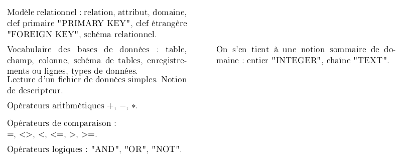
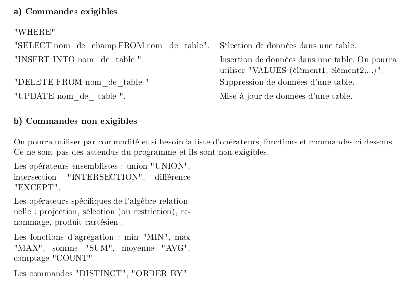

# Cours de SQL

## 1. Extraits du programme officiel

### 1.1 Première année
{: .center}
{: .center}


### 1.2 Deuxième année
{: .center}


## 2. Modèle relationnel
Théorisé en 1970 par le Britannique Edgard J. Codd, 
le modèle relationnel est à ce jour le modèle de base de données le plus utilisé, même si l'ère actuelle du Big Data tend à mettre en avant d'autres modèles non relationnels (nous en reparlerons).


!!! abstract "Les principes de base du modèle relationnel"
    - Les données sont regroupées dans différentes **tables** (qu'on appellera plutôt **relations** et qui donnent son nom au modèle). Chaque relation contient des éléments directement en lien avec le sujet général de la table.
    - Autant que possible, des données identiques ne doivent pas se trouver dans des tables différentes : on évite la **redondance** des données.
    - Les données ne doivent pas contenir elles-mêmes d'autres données : on parle d'**atomicité** des données.


Un modèle relationnel est donc basé sur des... **relations**.

### 2.1 Première relation

Prenons l'exemple d'une bibliothèque dont la base de données possède une relation «livres» :


!!! aide "Vocabulaire :heart: :heart: :heart:"
    - **relation**, ou **table** : c'est l'endroit où sont rangées les données. L'ordre des lignes (que l'on appelera des enregistrements) n'a pas d'importance.
    - **enregistrement**, ou **tuple**, ou **n-uplet**, ou **t-uplet**, ou **vecteur** : cela correspond à une ligne du tableau, et donc un ensemble de valeurs liées entre elles : l'auteur «Eric VUILLARD» a bien écrit le livre «L'Ordre du jour». 
    Il est **interdit** que deux enregistrements soient totalement identiques. 
    Le nombre d'enregistrements d'une relation s'appelle son **cardinal**.
    - **attribut** : c'est l'équivalent d'une colonne. Il y a dans notre relation un attribut «code», un attribut «Titre», etc.
    - **domaine** : le domaine désigne «le type» (au sens type ```Int```, ```Float```, ```String```).      
    L'attribut «Éditeur» est une chaîne de caractères, son domaine est donc ```String```.  
    Par contre l'attribut «ISBN» est un nombre de 13 chiffres, commençant manifestement par 978. Son domaine est donc ```Int```.
    - **schéma** : le schéma d'une relation est le regroupement de tous les attributs et de leur domaine respectif. Ici notre schéma serait : 
    ```((Code, Entier), (Titre, Chaîne de caractères), (Auteur, Chaîne de caractères), (Éditeur, Chaîne de caractères), (ISBN, Entier))``` 


### 2.2 Clé Primaire

!!! note "Clé primaire :heart:"
    Une clé primaire (**PRIMARY KEY**) est un attribut (ou une réunion d'attributs) **dont la connaissance suffit à identifier avec certitude un unique enregistrement**.

Par exemple, la clé primaire de la relation des personnes nées en France pourrait être leur [numéro de Sécurité Sociale](https://fr.wikipedia.org/wiki/Num%C3%A9ro_de_s%C3%A9curit%C3%A9_sociale_en_France){:target="_blank"}.


 Observons, dans notre relation précédente, ce qui peut être une clé primaire et ce qui ne peut pas l'être.

- Titre : cet attribut pourrait jouer le rôle de clé primaire. En effet, notre table ne contient pas deux livres ayant le même titre.
- Auteur : cet attribut pourrait jouer le rôle de clé primaire. En effet, notre table ne contient pas deux livres ayant le même auteur.
- Éditeur : cet attribut ne peut **pas** jouer le rôle de clé primaire. En effet, la donnée de l'attribut «Actes Sud» renvoie vers 4 livres différents.
- ISBN : (International Standard Book Number) cet attribut est un numéro unique spécifique à chaque livre : il peut jouer le rôle de clé primaire.
- Code : cet attribut pourrait jouer le rôle de clé primaire. En effet, notre table ne contient pas deux livres ayant le même code.


### 2.3 Clé Étrangère

Ajoutons maintenant les relations ci-dessous :

 **Relation «Emprunts»** 

| id_emprunteur | date       | Nom    | Prénom | titre             | auteur          | code |
|---------------|------------|--------|--------|-------------------|-----------------|------|
| 845           | 12/10/2020 | DURAND | Michel | Au revoir là-haut | Pierre LEMAITRE | 942  |
| 125           | 13/10/2020 | MARTIN | Jean   | Pas pleurer       | Lydie SALVAYRE  | 1023 |
| 125           | 13/10/2020 | MARTIN | Jean   | Boussole          | Mathias ENARD   | 486  |

 **Relation «Emprunteurs»** 

| id_emprunteur | Nom    | Prénom | 
|---------------|--------|--------|
| 129           | DULAC | Marcel  | 
| 845           | DURAND | Michel |
| 125           | MARTIN | Jean   |

L'attribut «id_emprunteur» est une clé primaire de la relation «Emprunteurs».


**Notion de clé étrangère** 

Y-a-t-il une clé primaire dans la relation «Emprunts» ? 

«id_emprunteur» est bien une clé primaire (d'«Emprunteurs») mais ne peut pas être une clé primaire d'«Emprunts», car une personne peut prendre plusieurs livres à la fois : on dit que c'est une **clé étrangère**. 

!!! note "Clé étrangère :heart:"
    Une clé étrangère (**FOREIGN KEY**)est une clé primaire d'une autre relation.

«code» est aussi une clé étrangère : c'est une clé primaire (de la relation «livres») mais elle ne peut pas jouer le rôle de clé primaire pour la relation emprunt, car un même livre pourra être pris à différentes dates.
