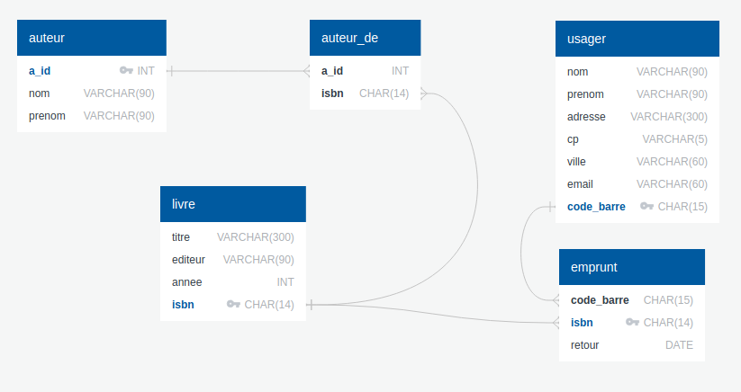

# Exécuter du SQL en ligne

## 1. Sur le site ```sqlonline.com```

- Rendez vous sur [https://sqliteonline.com/](https://sqliteonline.com/)
- Par File / OpenDB, uploadez votre fichier ```.db```. 
- Écrivez votre requête plus cliquez sur Run.  


## 2. Sur ce site


### 2.1  Base de données ```livres.db```

{: .center}

{!{ sqlide titre="**Requête :**"  base="data/livres.db"}!}