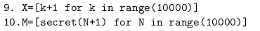

# TD02 : Premières simulations

{{ initexo(0) }}

:arrow_right: [Lien pour ouvrir une console Python dans un nouvel onglet](https://console.basthon.fr/){. target="_blank"}

## 1. Rappels

Chaque langage de programmation permet de simuler du hasard. Ce hasard n'est que du **pseudo-hasard**, un ordinateur étant par définition un objet déterministe, effectuant de manière fidèle et répétitive des opérations ordonnées par le programmeur.

Nous allons travailler avec le générateur pseudo-aléatoire (GPA) du module ```random``` de la bibliothèque ```numpy```. 

!!! note "Exemples :heart:"
    ```python
    >>> import numpy as np
    >>> import numpy.random as rd
    >>> rd.random()
    0.5488135039273248
    >>> rd.random()
    0.7151893663724195
    >>> rd.random()
    0.6027633760716439
    >>> rd.seed(0)  # réinitialisation de la graine du GPA
    >>> rd.random()
    0.5488135039273248 # les mêmes nombres reviennent...
    >>> rd.random()
    0.7151893663724195
    ```


##  2. Lancers de dés
!!! example "{{ exercice() }}"

    Que fait le code ci-dessous ?
    ```python linenums='1'
    
    import numpy as np
    import numpy.random as rd

    def mystere(val):
        n = 100
        c = 0
        j = 0
        while j < n:
            x = 1 + np.floor(6*rd.random())
            y = 1 + np.floor(6*rd.random())
            if x + y == val:
                c += 1
            j += 1

        return c/n
    ```

    Remarque : l'instruction ```#!python np.floor(6*rd.random())``` aurait pu avantageusement être remplacée par ```#!python rd.randint(1,6)```.  

    {{
    correction(False,
    """
    ??? success \"Correction\" 
        Pour une valeur ```val``` rentrée en paramètre, il renvoie la fréquence d'apparition de cette valeur lorsqu'on lance 100 fois 2 dés et qu'on observe leur somme.         
    """
    )
    }}
    
 
        


## 3. Utilisation de ```matplotlib```

```matplotlib``` est une bibliothèque permettant le tracé de graphiques. Elle sera systématiquement importée par :

```python
import matplotlib.pyplot as plt
```


Le code :
```python linenums='1'
import matplotlib.pyplot as plt
X = [0,1,3,6]
Y = [12,10,7,15]
plt.plot(X,Y,'ro') # r pour red, o pour un cercle. voir https://matplotlib.org/api/markers_api.html
plt.show()
```
fait apparaître le graphique suivant
{: .center}
    

On y retrouve les points de coordonnées (0,12), (1,10), ..., (6,15).
On aurait aussi pu tracer la ligne brisée les reliant :


```python linenums='1'
import matplotlib.pyplot as plt
plt.clf() # pour effacer les anciens graphiques
X = [0,1,3,6]
Y = [12,10,7,15]
plt.plot(X,Y,'b-') # b pour blue, - pour des segments
plt.show()
```

{: .center width=40%}


Ou bien encore un diagramme en barres :

```python linenums='1'
import matplotlib.pyplot as plt
plt.clf() # pour effacer les anciens graphiques
X = [0,1,3,6]
Y = [12,10,7,15]
plt.bar(X,Y) 
plt.show()
```

{: .center width=40%}


## 4. Construire une liste

Nous avons vu que ```matplotlib``` nécessite la création de deux listes ```X``` et ```Y``` contenant respectivement les abscisses et les ordonnées qui nous intéressent. 

Comment construire ces listes ? De nombreuses méthodes existent en Python.

### 4.1 Construire une liste de nombres entiers consécutifs

Ceci est nécessaire pour construire la liste des abscisses. On utilisera alors l'instruction ```arange``` de ```numpy``` : 

- ```np.arange(n1,n2)``` : renvoie un tableau (qu'on considèrera comme un liste) contenant tous les entiers de ```n1``` (inclus) à   ```n2``` (**exclus**). Très souvent utilisé pour construire la liste ```X```.


:arrow_right: **Exemple :**

```python
>>> np.arange(1,7)
array([1, 2, 3, 4, 5, 6])
```


### 4.2 Construire une liste pleine de zéros

L'instruction ```zeros``` de ```numpy``` permet de construire un tableau plein de zéros.

:arrow_right: **Exemple :**

```python
>>> np.zeros(6)
array([0., 0., 0., 0., 0., 0.])
```

Mais pourquoi un tableau plein de zéros ? Pour pouvoir le remplir ensuite avec une boucle :


:arrow_right: **Exemple :**

```python linenums='1'
import numpy as np
import matplotlib.pyplot as plt

X = np.arange(10)
Y = np.zeros(10)

def f(x):
    return np.log(x+1) 

for k in range(10):
    Y[k] = f(k) 

plt.clf()
plt.plot(X, Y, '-')
plt.show()
    
```

### 4.3 Construire une liste directement (méthode *par compréhension*)

C'est de loin la méthode la plus élégante. Elle consiste à écrire à l'intérieur de la liste la formule de création de celle-ci.

:arrow_right: **Exemple :**

```python
>>> lst = [k**2 for k in range(6)]
>>> lst
[0, 1, 4, 9, 16, 25]
```

Le code précédent de tracé de la fonction $\ln(x+1)$ peut donc s'écrire aussi :

```python linenums='1'
import numpy as np

def f(x):
    return np.log(x+1) 

X = np.arange(10)
Y = [f(k) for k in X] 

plt.clf()
plt.plot(X, Y, '-')
plt.show()
```

!!! tip "connaître les listes en compréhension"
    Pour la 1ère fois en 2024 un sujet (Ecricome) contenait des listes en compréhension :
    {: .center}
    À l'issue des lignes 8 et 9, que contiennent les variables ```X``` et ```M``` ?

    - ```X``` est une liste contenant tous les nombres entiers entre 1 et 10000.
    - ```M``` est une liste contenant l'image par la fonction ```secret``` (définie plus haut dans le code) de tous les nombres entiers entre 1 et 10000. 

!!! example "{{ exercice() }}"

    Tracer le diagramme en barres de la fonction ```mystere``` de l'exercice 1, pour des valeurs allant entre 0 et 12.

    {{
    correction(False,
    """
    ??? success \"Correction\" 
        ```python linenums='1'
        import numpy as np
        import numpy.random as rd
        import matplotlib.pyplot as plt

        def mystere(val):
            n = 1000
            c = 0
            j = 0
            while j < n:
                x = 1 + np.floor(6*rd.random())
                y = 1 + np.floor(6*rd.random())
                if x + y == val:
                    c += 1
                j += 1

            return c/n


        plt.clf()
        X = np.arange(13)
        Y = np.zeros(13)
        for k in range(13):
            Y[k] = mystere(k)
        plt.bar(X,Y) 
        plt.show()
        ```        
    """
    )
    }}
        

        


## 5. Retour sur le ```while```.


!!! example "{{ exercice() }}"

    Écrire un code où l'utilisateur doit deviner un nombre choisi aléatoirement par l'ordinateur entre 1 et 100. L'utilisateur devra être guidé après chaque proposition par les instructions *«trop grand»* ou *«trop petit»*.

    :material-lifebuoy: *aide :*

    ```python linenums='1'
    import numpy as np
    import numpy.random as rd

    nb_secret = ...

    prop = int(input("proposition ? "))
    while ...
        ...

    ```

    {{
    correction(False,
    """
    ??? success \"Correction\" 
        ```python linenums='1'
        import numpy as np
        import numpy.random as rd

        nb_secret = 1 + np.floor(100*rd.random())

        prop = int(input('proposition ? '))
        while prop != nb_secret:
            if prop > nb_secret:
                print('trop grand')
            else:
                print('trop petit')
            prop = int(input('proposition ? '))

        print('bravo !')
        ```        
    """
    )
    }}

        

## 6.  Simulations d'une expérience de Bernoulli

Comme l'instruction ```rd.random()``` renvoie un nombre aléatoire entre 0 et 1, une variable aléatoire suivant une loi de probabilité de Bernoulli de paramètre $p$ peut être simulée par un test d'appartenance de ```rd.random()``` à l'intervalle :

- $[0;p]$ (succès)

ou

- $]p;1]$ (échec) :

{: .center}


!!! example "{{ exercice() }}"

    On considère une urne comportant 3 boules blanches et 5 boules noires. 

    **Q1.** Créer une fonction ```tirage()``` renvoyant la valeur 1 si la boule tirée est blanche, et la valeur 0 si la boule tirée est noire.
    {{
    correction(False,
    """
    ??? success \"Correction\" 
        ```python linenums='1'
        import numpy as np
        import numpy.random as rd

        def tirage():
            x = rd.random()
            if x < 3/8:
                return 1
            else:
                return 0
        ```        
    """
    )
    }}

    **Q2.** Simuler 100 000 fois cette expérience aléatoire et afficher la fréquence d'apparition d'une boule blanche. 
    
    {{
    correction(False,
    """
    ??? success \"Correction\" 
        ```python linenums='1'
        nb_tirages = 10**5
        somme_blanches = 0
        for k in range(nb_tirages):
            somme_blanches += tirage()

        print(somme_blanches / nb_tirages)
        ```        
    """
    )
    }}
        

        
        

        
!!! example "{{ exercice() }}"
    *inspiré du sujet ESC 2023*

    On considère une pièce équilibrée ($p=\frac{1}{2}$) que l'on lance successivement trois fois. On note $S$ la variable aléatoire égale au nombre de PILE obtenus au cours de ces trois lancers. On note aussi $T$ la variable aléatoire égale à  $0$ si on n'obtient aucun PILE lors de ces trois lancers et égale au rang du premier PILE obtenu si un PILE apparaît.

    Par exemple, si une succession de trois lancers amène «FPF» on a $S=1$ et $T=2$.
    
    Le programme Python ci-dessous a pour objectif de simuler une succession de 3 lancers et d'afficher les valeurs prises par $S$ et $T$. 

    **Q1.** Compléter le code ci-dessous :

    ```python linenums='1'
    import numpy.random as rd
    S = 0
    T = 0
    for k in range(1,4):
        r = rd.random()
        if r < 1/2:
            S = ...
        if r < 1/2 and T == 0:
            T = ...
    print('S=', S, 'et T=', T)
    ``` 

    {{
    correction(False,
    """
    ??? success \"Correction\" 
        ```python linenums='1'
        import numpy.random as rd
        S = 0
        T = 0
        for k in range(1,4):
            r = rd.random()
            if r < 1/2:
                S = S + 1
            if r < 1/2 and T == 0:
                T = k
        print('S=', S, 'et T=', T)

        ```        
    """
    )
    }}

    **Q2.** Ce code comporte une répétition qui était largement évitable. Proposer un code plus élégant.

    {{
    correction(False,
    """
    ??? success \"Correction\" 
        ```python linenums='1'
        import numpy.random as rd
        S = 0
        T = 0
        for k in range(1,4):
            r = rd.random()
            if r < 1/2:
                S = S + 1
                if T == 0:
                    T = k
        print('S=', S, 'et T=', T)

        ```
                
    """
    )
    }}
        


## 7. Retour sur les suites

!!! example "{{ exercice() }}"
    *extrait du sujet 0 Ecricome*

    On considère la suite $(u_n)_{n \in \mathbb{N}^*}$ définie par $u_1=\dfrac{2}{3}$ et, $\forall n \in \mathbb{N}^*, u_{n+1}=\dfrac{n+1}{3n}u_n$.

    **Q1.** Calculer $u_1$ et $u_3$. Donner les résultats sous forme de fraction irréductible.

    {{
    correction(False,
    """
    ??? success \"Correction\" 
        $u_2=\dfrac{4}{9}$ et $u_3 = \dfrac{2}{9}$            
    """
    )
    }}
    **Q2.** Compléter la fonction Python ci-desous qui prend en entrée la valeur $n$ et renvoie la valeur de $u_n$.

    ```python linenums='1'
    def suite(n):
        u = 2/3
        for k in range(1, n):
            u = ...
        return u
    ```

    {{
    correction(False,
    """
    ??? success \"Correction\" 
        ```python linenums='1'
        def suite(n):
            u = 2/3
            for k in range(1, n):
                u = (k+1)/(3*k) * u
            return u
        ```        
    """
    )
    }}
    

!!! example "{{ exercice() }}"
    *inspiré du sujet Ecricome 2019*

    Soit $g$ la fonction numérique réelle définie sur l'intervalle $]0;+\infty[$ par :

    $$ g(x)=2x-1+\ln \left( \frac{x}{x+1} \right) $$

    **Q1.** Écrire en Python la fonction $g$.

    {{
    correction(False,
    """
    ??? success \"Correction\" 
        ```python linenums='1'
        import numpy as np
        def g(x):
            return 2*x - 1 + np.log(x / (x+1))
        ```        
    """
    )
    }}

    Le script Python ci-dessous construit un vecteur ligne contenant les 50 premiers termes de la suite $(u_n)_{n \geqslant 1}$, définie par :

    $$u_n = 2n-1-g(n)$$ 
    
    pour $n \geqslant 1$.

    ```python linenums='1'
    u = np.zeros(50)
    for n in range(1,50):
        u[n] = 2*n - 1 - g(n)


    S = np.cumsum(u)
    X = np.arange(50)

    plt.plot(X,S)
    plt.show()
    ```

    **Q2.** Interpréter le contenu de la ligne 6 dans le contexte de l'énoncé.

    {{
    correction(False,
    """
    ??? success \"Correction\" 
        L'expression ```S = np.cumsum(u)``` permet de calculer le vecteur de sommes cumulées de la suite $u$.        
    """
    )
    }}

    **Q3.** Exécutez le script précédent et observez le graphique obtenu.

    {{
    correction(False,
    """
    ??? success \"Correction\" 
        {: .center}        
    """
    )
    }}

    **Q4.** Sur ce même graphique, tracez la courbe représentative de la fonction $\ln$.

    {{
    correction(False,
    """
    ??? success \"Correction\" 
        ```python linenums='1'
        import numpy as np
        import matplotlib.pyplot as plt

        def g(x):
            return 2*x - 1 + np.log(x / (x+1))


        u = np.zeros(50)
        for n in range(1,50):
            u[n] = 2*n - 1 - g(n)


        S = np.cumsum(u)
        X = np.arange(50)

        plt.clf()
        plt.plot(X,S)
        plt.plot(X, np.log(X))
        plt.show()
        ```   

        {: .center}        
    """
    )
    }}


        