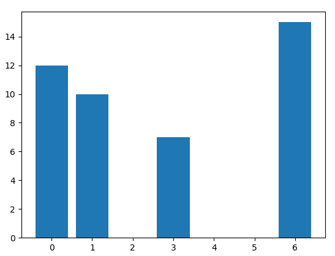
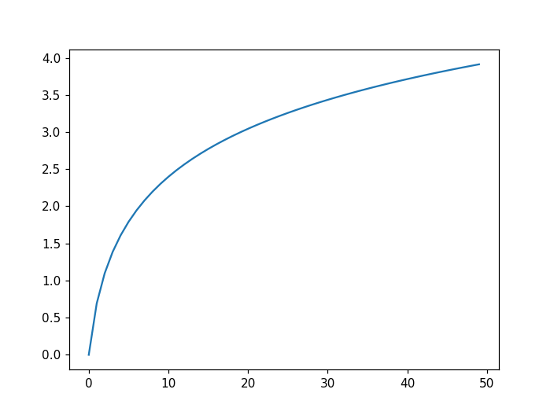
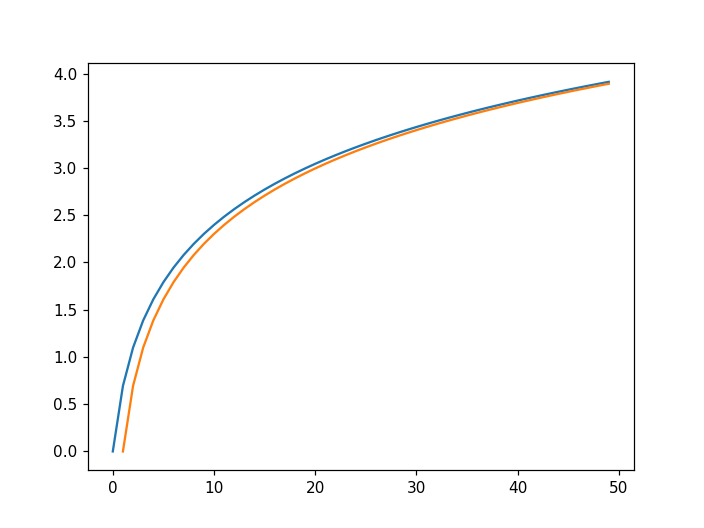

# TD02 : Premières simulations

:arrow_right: [Lien pour ouvrir une console Python dans un nouvel onglet](https://console.basthon.fr/){. target="_blank"}

## 1. Rappels

Chaque langage de programmation permet de simuler du hasard. Ce hasard n'est que du **pseudo-hasard**, un ordinateur étant par définition un objet déterministe, effectuant de manière fidèle et répétitive des opérations ordonnées par le programmeur.

Nous allons travailler avec le générateur pseudo-aléatoire (GPA) du module ```random``` de la bibliothèque ```numpy```. 

!!! note "Exemples :heart:"
    ```python
    >>> import numpy as np
    >>> import numpy.random as rd
    >>> rd.random()
    0.5488135039273248
    >>> rd.random()
    0.7151893663724195
    >>> rd.random()
    0.6027633760716439
    >>> rd.seed(0)  # réinitialisation de la graine du GPA
    >>> rd.random()
    0.5488135039273248 # les mêmes nombres reviennent...
    >>> rd.random()
    0.7151893663724195
    ```


##  2. Lancers de dés
!!! abstract "Exercice 1"
    === "Énoncé"
        Que fait le code ci-dessous ?
        ```python
        import numpy as np
        import numpy.random as rd

        def mystere(val):
            n = 100
            c = 0
            j = 0
            while j < n:
                x = 1 + np.floor(6*rd.random())
                y = 1 + np.floor(6*rd.random())
                if x + y == val:
                    c += 1
                j += 1

            return c/n
        ```

        Remarque : l'instruction ```#!python np.floor(6*rd.random())``` aurait pu avantageusement être remplacée par ```#!python rd.randint(1,6)```.  
<!--     === "Correction"
        Pour une valeur ```val``` rentrée en paramètre, il renvoie la fréquence d'apparition de cette somme lors de 100 lancers de 2 dés puis d'ajout de leur valeur.  -->

## 3. Utilisation de ```matplotlib```

```matplotlib``` est une bibliothèque permettant le tracé de graphiques. Elle sera systématiquement importée par :

```python
import matplotlib.pyplot as plt
```


Le code :
```python linenums='1'
import matplotlib.pyplot as plt
X = [0,1,3,6]
Y = [12,10,7,15]
plt.plot(X,Y,'ro') # r pour red, o pour un cercle. voir https://matplotlib.org/api/markers_api.html
plt.show()
```
fait apparaître le graphique suivant
{: .center}
    

On y retrouve les points de coordonnées (0,12), (1,10), ..., (6,15).
On aurait aussi pu tracer la ligne brisée les reliant :


```python linenums='1'
import matplotlib.pyplot as plt
plt.clf() # pour effacer les anciens graphiques
X = [0,1,3,6]
Y = [12,10,7,15]
plt.plot(X,Y,'b-') # b pour blue, - pour des segments
plt.show()
```

{: .center width=40%}


Ou bien encore un diagramme en barres :

```python linenums='1'
import matplotlib.pyplot as plt
plt.clf() # pour effacer les anciens graphiques
X = [0,1,3,6]
Y = [12,10,7,15]
plt.bar(X,Y) 
plt.show()
```

{: .center width=40%}


## 4. Construire une liste

Nous avons vu que ```matplotlib``` nécessite la création de deux listes ```X``` et ```Y``` contenant respectivement les abscisses et les ordonnées qui nous intéressent. 

Comment construire ces listes ? De nombreuses méthodes existent en Python.

### 4.1 Construire une liste de nombres entiers consécutifs

Ceci est nécessaire pour construire la liste des abscisses. On utilisera alors l'instruction ```arange``` de ```numpy``` : 

- ```np.arange(n1,n2)``` : renvoie un tableau (qu'on considèrera comme un liste) contenant tous les entiers de ```n1``` (inclus) à   ```n2``` (**exclus**). Très souvent utilisé pour construire la liste ```X```.


:arrow_right: **Exemple :**

```python
>>> np.arange(1,7)
array([1, 2, 3, 4, 5, 6])
```
### 4.2 Construire une liste pleine de zéros

L'instruction ```zeros``` de ```numpy``` permet de construire un tableau plein de zéros.

:arrow_right: **Exemple :**

```python
>>> np.zeros(6)
array([0., 0., 0., 0., 0., 0.])
```

Mais pourquoi un tableau plein de zéros ? Pour pouvoir le remplir ensuite avec une boucle :


:arrow_right: **Exemple :**

```python linenums='1'
import numpy as np
import matplotlib.pyplot as plt

X = np.arange(10)
Y = np.zeros(10)

def f(x):
    return np.log(x+1) 

for k in range(10):
    Y[k] = f(k) 

plt.clf()
plt.plot(X, Y, '-')
plt.show()
    
```

### 4.3 Construire une liste directement (méthode *par compréhension*)

C'est de loin la méthode la plus élégante. Elle consiste à écrire à l'intérieur de la liste la formule de création de celle-ci.

:arrow_right: **Exemple :**

```python
>>> lst = [k**2 for k in range(6)]
>>> lst
[0, 1, 4, 9, 16, 25]
```

Le code précédent de tracé de la fonction $\ln(x+1)$ peut donc s'écrire aussi :

```python linenums='1'
import numpy as np

def f(x):
    return np.log(x+1) 

X = np.arange(10)
Y = [f(k) for k in X] 

plt.clf()
plt.plot(X, Y, '-')
plt.show()
```


!!! abstract "Exercice 2"
    === "Énoncé"
        Tracer le diagramme en barres de la fonction ```mystere``` de l'exercice 1, pour des valeurs allant entre 0 et 12.

    === "Correction"
        ```python linenums='1'
        import numpy as np
        import numpy.random as rd
        import matplotlib.pyplot as plt

        def mystere(val):
            n = 1000
            c = 0
            j = 0
            while j < n:
                x = 1 + np.floor(6*rd.random())
                y = 1 + np.floor(6*rd.random())
                if x + y == val:
                    c += 1
                j += 1

            return c/n


        plt.clf()
        X = np.arange(13)
        Y = np.zeros(13)
        for k in range(13):
            Y[k] = mystere(k)
        plt.bar(X,Y) 
        plt.show()
        ```


## 5. Retour sur le ```while```.


!!! abstract "Exercice 3"
    === "Énoncé"
        Écrire un code où l'utilisateur doit deviner un nombre choisi aléatoirement par l'ordinateur entre 1 et 100. L'utilisateur devra être guidé après chaque proposition par les instructions *«trop grand»* ou *«trop petit»*.

        :material-lifebuoy: *aide :*

        ```python linenums='1'
        import numpy as np
        import numpy.random as rd

        nb_secret = ...

        prop = int(input("proposition ? "))
        while ...
            ...

        ```

<!--    === "Correction"
        ```python linenums='1'
        import numpy as np
        import numpy.random as rd

        nb_secret = 1 + np.floor(100*rd.random())

        prop = int(input("proposition ? "))
        while prop != nb_secret:
            if prop > nb_secret:
                print("trop grand")
            else:
                print("trop petit")
            prop = int(input("proposition ? "))

        print("bravo !")
        ``` -->

## 6.  Simulations d'une expérience de Bernoulli

Comme l'instruction ```rd.random()``` renvoie un nombre aléatoire entre 0 et 1, une variable aléatoire suivant une loi de probabilité de Bernoulli de paramètre $p$ peut être simulée par un test d'appartenance de ```rd.random()``` à l'intervalle :

- $[0;p]$ (succès)

ou

- $]p;1]$ (échec) :

{: .center}


!!! abstract "Exercice 4"
    === "Énoncé"
        On considère une urne comportant 3 boules blanches et 5 boules noires. 

        1. Créer une fonction ```tirage()``` renvoyant la valeur 1 si la boule tirée est blanche, et la valeur 0 si la boule tirée est noire.
        2. Simuler 100 000 fois cette expérience aléatoire et afficher la fréquence d'apparition d'une boule blanche. 
    
    === "Correction Q1"
        ```python linenums='1'
        import numpy as np
        import numpy.random as rd

        def tirage():
            val_alea = rd.random()
            if val_alea < 3/8:
                return 1
            else:
                return 0
        ```

    === "Correction Q2"
        ```python linenums='1'
        nb_tirages = 10**5
        somme_blanches = 0
        for k in range(nb_tirages):
            somme_blanches += tirage()

        print(somme_blanches / nb_tirages)
        ```


## 7. Retour sur les suites

!!! abstract "Exercice 5"
    *extrait du sujet 0 Ecricome*
    === "Énoncé"
         On considère la suite $(u_n)_{n \in \mathbb{N}^*}$ définie par $u_1=\dfrac{2}{3}$ et, $\forall n \in \mathbb{N}^*, u_{n+1}=\dfrac{n+1}{3n}u_n$.

         1. Calculer $u_1$ et $u_3$. Donner les résultats sous forme de fraction irréductible.
         2. Compléter la fonction Python ci-desous qui prend en entrée la valeur $n$ et renvoie la valeur de $u_n$.

         ```python linenums='1'
         def suite(n):
             u = 2/3
             for k in range(1, n):
                 u = ...
             return u
         ```

    
<!--     === "Correction Q1"
        $u_2=\dfrac{4}{9}$ et $u_3 = \dfrac{2}{9}$
    
    === "Correction Q2"
        ```python linenums='1'
        def suite(n):
            u = 2/3
            for k in range(1, n):
                u = (k+1)/(3*k) * u
            return u
        ``` -->

!!! abstract "Exercice 6"
    *inspiré du sujet Ecricome 2019*
    === "Énoncé"
        Soit $g$ la fonction numérique réelle définie sur l'intervalle $]0;+\infty[$ par :

        $$ g(x)=2x-1+\ln \left( \frac{x}{x+1} \right) $$

        **Q1.** Écrire en Python la fonction $g$.

        Le script Python ci-dessous construit un vecteur ligne contenant les 50 premiers termes de la suite $(u_n)_{n \geqslant 1}$.

        ```python linenums='1'
        u = np.zeros(50)
        for n in range(1,50):
            u[n] = 2*n - 1 - g(n)


        S = np.cumsum(u)
        X = np.arange(50)

        plt.plot(X,S)
        plt.show()
        ```

        **Q2.** Interpréter le contenu de la ligne 6 dans le contexte de l'énoncé.

        **Q3.** Exécutez le script précédent et observez le graphique obtenu.

        **Q4.** Sur ce même graphique, tracez la courbe représentative de la fonction $\ln$.

<!--     === "Correction Q1"
        ```python linenums='1'
        import numpy as np
        def g(x):
            return 2*x - 1 + np.log(x / (x+1))
        ``` -->

<!--     === "Correction Q2"
        L'expression ```S = np.cumsum(u)``` permet de calculer le vecteur de sommes cumulées de la suite $u$.

    === "Correction Q3"
        {: .center} -->
        

<!--     === "Correction Q4" 
        ```python linenums='1'
        import numpy as np
        import matplotlib.pyplot as plt

        def g(x):
            return 2*x - 1 + np.log(x / (x+1))


        u = np.zeros(50)
        for n in range(1,50):
            u[n] = 2*n - 1 - g(n)


        S = np.cumsum(u)
        X = np.arange(50)

        plt.clf()
        plt.plot(X,S)
        plt.plot(X, np.log(X))
        plt.show()
        ```   

        {: .center} -->
        
        