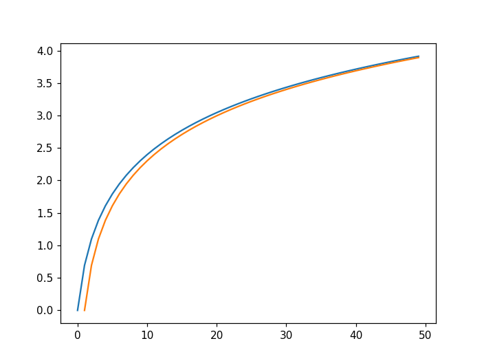

# TD03 : suites et simulations

{{ initexo(0) }}

:arrow_right: [Lien pour ouvrir une console Python dans un nouvel onglet](https://console.basthon.fr/){. target="_blank"}


!!! tip "rappel de la syntaxe d'importation de ```numpy.random```"
    ```python linenums='1'
    import numpy as np
    import numpy.random as rd
    ```


!!! example "{{ exercice() }}"
    *inspiré par Ecricome 2018*

    On considère une urne $U$ contenant deux boules blanches et une boule noire indiscernables au toucher, ainsi qu’une urne $V$ contenant une boule blanche et trois boules noires, elles aussi indiscernables au toucher. On effectue une suite de tirages d’une boule dans ces urnes en procédant comme suit :

    - le premier tirage a lieu dans l’urne U ;
    - tous les tirages s’effectuent avec remise de la boule piochée dans l’urne dont elle provient;
    - si l’on pioche une boule blanche lors d’un tirage, le tirage suivant a lieu dans l’autre urne;
    - si l’on pioche une boule noire lors d’un tirage, le tirage suivant a lieu dans la même urne.

    Pour tout entier naturel non nul $n$, on note $X_n$ la variable aléatoire égale au nombre de boules blanches piochées au cours des $n$ premiers tirages.

    On rappelle qu’en Python, l’instruction ```rd.randint(1,k)```  renvoie un entier aléatoire compris entre 1 et ```k-1``` .


    **Q1.** Recopier et compléter les lignes à pointillés du script Python ci-dessous afin qu’il simule la variable aléatoire $X_2$ :

    ```python linenums='1'
    import numpy as np
    import numpy.random as rd

    def simulation():
        tirage1 = rd.randint(1, 4)
        if tirage1 < 3:
            res1 = 1
            tirage2 = rd.randint(1, 5)
            if tirage2 == 1:
                res2 = 1
            else:
                res2 = 0
        else:
            res1 = 0
            tirage2 = ...
            if tirage2 < 3:
                res2 = ...
            else:
                res2 = ...

        X = ... + ...
        return X
    ```

    {{
    correction(True,
    """
    ??? success \"Correction\" 
        ```python linenums='1' hl_lines='15 17 19 21'
        import numpy as np
        import numpy.random as rd

        def simulation():
            tirage1 = rd.randint(1, 4)
            if tirage1 < 3:
                res1 = 1
                tirage2 = rd.randint(1, 5)
                if tirage2 == 1:
                    res2 = 1
                else:
                    res2 = 0
            else:
                res1 = 0
                tirage2 = rd.randint(1, 4)
                if tirage2 < 3:
                    res2 = 1
                else:
                    res2 = 0

            X = res1 + res2
            return X
        ```        
    """
    )
    }}

    **Q2.** Écrire une fonction ```freq(n)``` qui renvoie la valeur moyenne du nombre de boules blanches tirées sur ```n``` expériences réalisées.

    {{
    correction(True,
    """
    ??? success \"Correction\" 
        ```python linenums='1'
        def freq(n):
            compteur = 0
            for k in range(n):
                compteur += simulation()
            return compteur / n
        ```        
    """
    )
    }}

    **Q3.** En déduire $E(X_2)$ et retrouver ce résultat par un calcul théorique.

    {{
    correction(True,
    """
    ??? success \"Correction\" 
        Expérimentalement :
        ```python
        >>> freq(10**6)
        1.055416
        ```
    
        Théoriquement, en faisant un arbre de probabilités,

        $$E(X_2) = 2 \\times \\dfrac{2}{12} +  1 \\times \\dfrac{6}{12} +  1 \\times \\dfrac{2}{9} = \\dfrac{38}{36}=\\dfrac{19}{18}$$        
    """
    )
    }}

        


## 2. Modélisation(s) d'une suite

L'étude des suites donne lieu à **deux approches** radicalement différentes :

:arrow_right: **Approche 1** : à l'aide une seule variable «simple»

Chaque terme est calculé successivement à partir du précédent dans une seule et unique variable «simple». Cette variable est initialisée avec le 1er terme.

*Exemple :* 

le n-ième terme de la suite définie par $u_{n+1}=2u_n + 1$ et $u_0 = 3$ sera calculé par:
```python linenums='1'
def terme_de_rang_n(n):
    u = 3
    for k in range(1, n+1): # attention au n+1
        u = 2*u + 1
    return u
```
:white_check_mark: *Avantages* : simplicité, rapidité, peu d'espace-mémoire 

:name_badge: *Inconvénients* : aucun accès à tous les termes de la suite !


:arrow_right: **Approche 2** : à l'aide une  variable de type liste

Chaque terme est calculé successivement à partir du précédent et **stocké** dans une liste. Cette liste est souvent préparée au préalable, remplie de 0 qui seront peu à peu remplacés par les termes de la suite.

*Exemple :* 

Les n premiers termes de la suite définie par $u_{n+1}=2u_n + 1$ et $u_0 = 3$ seront calculés par:
```python linenums='1'
import numpy as np
def n_premiers_termes(n):
    u = np.zeros(n+1) # on commence à l'indice 0 donc il faut n+1 cases
    u[0] = 3
    for k in range(1, n+1): # attention au n+1
        u[k] = 2*u[k-1] + 1
    return u
```
:white_check_mark: *Avantages* : tous les termes sont disponibles (on peut les cumuler, les tracer...)

:name_badge: *Inconvénients* : lenteur, complexité, place mémoire.


!!! example "{{ exercice() }}"
    *extrait du sujet 0 Ecricome*

    On considère la suite $(u_n)_{n \in \mathbb{N}^*}$ définie par $u_1=\dfrac{2}{3}$ et, $\forall n \in \mathbb{N}^*, u_{n+1}=\dfrac{n+1}{3n}u_n$.

    1. Calculer $u_2$ et $u_3$. Donner les résultats sous forme de fraction irréductible.

    {{
    correction(True,
    """
    ??? success \"Correction\" 
        $u_2=\dfrac{4}{9}$ et $u_3 = \dfrac{2}{9}$        
    """
    )
    }}

    2. Compléter la fonction Python ci-dessous qui prend en entrée la valeur $n$ et renvoie la valeur de $u_n$.

    ```python linenums='1'
    def suite(n):
        u = 2/3
        for k in range(1, n):
            u = ...
        return u
    ```

    {{
    correction(False,
    """
    ??? success \"Correction\" 
        ```python linenums='1'
        def suite(n):
            u = 2/3
            for k in range(1, n):
                u = (k+1)/(3*k) * u
            return u
        ```        
    """
    )
    }}
        

        

!!! example "{{ exercice() }}"
    *inspiré du sujet Ecricome 2019*

    Soit $g$ la fonction numérique réelle définie sur l'intervalle $]0;+\infty[$ par :

    $$ g(x)=2x-1+\ln \left( \frac{x}{x+1} \right) $$

    **Q1.** Écrire en Python une fonction ```g``` représentant la fonction mathématique $g$. On rappelle que la fonction $ln$ s'écrit avec ```np.log```.

    {{
    correction(False,
    """
    ??? success \"Correction\" 
        ```python linenums='1'
        import numpy as np
        def g(x):
            return 2*x - 1 + np.log(x / (x+1))
        ```        
    """
    )
    }}

    Le script Python ci-dessous construit un vecteur ligne contenant les 50 premiers termes de la suite $(u_n)_{n \geqslant 1}$, définie par :

    $$u_n = 2n-1-g(n)$$ 
    
    pour $n \geqslant 1$.

    ```python linenums='1'
    import numpy as np
    import matplotlib.pyplot as plt

    u = np.zeros(50)
    for n in range(1,50):
        u[n] = 2*n - 1 - g(n)


    S = np.cumsum(u)
    X = np.arange(50)

    plt.plot(X,S)
    plt.show()
    ```


    **Q2.** Interpréter le contenu de la ligne 9 dans le contexte de l'énoncé.

    {{
    correction(False,
    """
    ??? success \"Correction\" 
        L'expression ```S = np.cumsum(u)``` permet de calculer le vecteur de sommes cumulées de la suite $u$.        
    """
    )
    }}

    **Q3.** Exécutez le script précédent et observez le graphique obtenu.

    {{
    correction(False,
    """
    ??? success \"Correction\" 
        {: .center}        
    """
    )
    }}

    **Q4.** Sur ce même graphique, tracez la courbe représentative de la fonction $\ln$.

    {{
    correction(False,
    """
    ??? success \"Correction\" 
        ```python linenums='1'
        import numpy as np
        import matplotlib.pyplot as plt

        def g(x):
            return 2*x - 1 + np.log(x / (x+1))


        u = np.zeros(50)
        for n in range(1,50):
            u[n] = 2*n - 1 - g(n)


        S = np.cumsum(u)
        X = np.arange(50)

        plt.clf()
        plt.plot(X,S)
        plt.plot(X, np.log(X))
        plt.show()
        ```   

        {: .center}        
    """
    )
    }}


        


!!! example "{{ exercice() }}"
    *inspiré du sujet ESCP 2023*

    On pose $u_{1}=\dfrac{1}{2}$ et, pour tout entier naturel $n$ non
    nul :

    $$u_{n+1}=\frac{u_{n}}{2(n+1)u_{n}+1}$$

    Compléter la fonction ci-dessous afin qu'elle renvoie la valeur de $u_n$ à l'appel de ```suite(n)``` :

    ```python linenums='1'
    def suite(n):
        u = ...
        for k in range(..., ...):
            u = ...
        return u
    ``` 

    {{
    correction(False,
    """
    ??? success \"Correction\" 
        ```python linenums='1'
        def suite(n):
            u = 1/2
            for k in range(1, n): 
                u = u / (2*(k+1)*u + 1)
            return u
        ```        
    """
    )
    }}

              

        
        

!!! example "{{ exercice() }}"
    *inspiré du sujet Ecricome 2023*


    On considère la suite $\left(u_n\right)_{n \geqslant 1}$ définie par : 

    $$ u_1 \in[0,1],\quad\text{ et }
    \forall n \in \mathbb{N}^*,  u_{n+1}=\dfrac{5}{12} u_n+\dfrac{1}{3}$$


    Compléter la fonction suivante, qui prend en entrée un entier naturel non nul ```n```  et un réel ```u1```  de $[0,1]$ correspondant au terme initial $u_1$ de la suite, et renvoie le terme $u_n$.

    ```python linenums='1'
    def suite(..., ...):
        u = ...
        for k in range(..., ...):
            u = ...
        return 
    ``` 

    {{
    correction(False,
    """
    ??? success \"Correction\" 
        ```python linenums='1'
        def suite(n, u1):
            u = u1
            for k in range(1, n):
                u = (5/12)*u + 1/3
            return u
        ```         
    """
    )
    }}


## 3. Un peu de ```while```...

!!! example "{{ exercice() }}"

    Écrire un code où l'utilisateur doit deviner un nombre choisi aléatoirement par l'ordinateur entre 1 et 100. L'utilisateur devra être guidé après chaque proposition par les instructions *«trop grand»* ou *«trop petit»*.

    :material-lifebuoy: *aide :*

    ```python linenums='1'
    import numpy as np
    import numpy.random as rd

    nb_secret = ...

    prop = int(input("proposition ? "))
    while ...
        ...

    ```
    {{
    correction(False,
    """
    ??? success \"Correction\" 
        ```python linenums='1'
        import numpy as np
        import numpy.random as rd

        nb_secret = 1 + np.floor(100*rd.random())

        prop = int(input('proposition ? '))
        while prop != nb_secret:
            if prop > nb_secret:
                print('trop grand')
            else:
                print('trop petit')
            prop = int(input('proposition ? '))

        print('bravo !')
        ```        
    """
    )
    }}