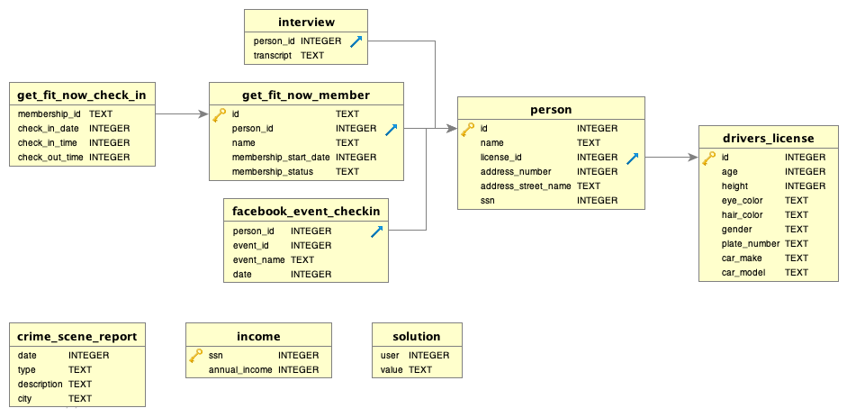

# TD04 : Découverte du langage SQL

!!! success ":star: :star: :star: Cours :star: :star: :star:"
    -  :arrow_right: [Cours sur le modèle relationnel](../CoursSQL/modele_relationnel.md){. target="_blank"}
    -  :arrow_right: [Cours sur le langage SQL](../CoursSQL/langage_SQL.md){. target="_blank"}

{{initexo(0)}}


!!! example "{{ exercice() }}"
    Questions interactives à réaliser sur le site [SQLzoo.net](https://sqlzoo.net/wiki/SELECT_from_Nobel_Tutorial){. target="_blank"}.

    Faire les questions de 1 à 10.

    {{
    correction(True,
    """
    ??? success \"Correction\" 
        Corrections extraites du dépôt *https://github.com/jisaw/sqlzoo-solutions*.
        ```SQL
        /*
        Third section of sqlzoo, SELECT from Nobel
        */

        --#1
        /*
        Change the query shown so that it displays Nobel prizes for 1950.
        */
        SELECT yr, subject, winner
        FROM nobel
        WHERE yr = 1950

        --#2
        /*
        Show who won the 1962 prize for Literature.
        */
        SELECT winner
        FROM nobel
        WHERE yr = 1962 AND subject = 'Literature'

        --#3
        /*
        Show the year and subject that won 'Albert Einstein' his prize.
        */
        SELECT yr, subject
        FROM nobel
        WHERE winner = 'Albert Einstein'

        --#4
        /*
        Give the name of the 'Peace' winners since the year 2000, including 2000.
        */
        SELECT winner
        FROM nobel
        WHERE subject = 'Peace' AND yr >= 2000

        --#5
        /*
        Show all details (yr, subject, winner) of the Literature prize winners for 1980 to 1989 inclusive
        */
        SELECT yr, subject, winner
        FROM nobel
        WHERE (yr >=1980 AND yr <=1989) AND subject = 'Literature'

        --#6
        /*
        Show all details of the presidential winners:

        Theodore Roosevelt
        Woodrow Wilson
        Jimmy Carter
        */
        SELECT *
        FROM nobel
        WHERE winner IN ('Theodore Roosevelt', 'Woodrow Wilson', 'Jimmy Carter')

        --#7
        /*
        Show the winners with first name John
        */
        SELECT winner
        FROM nobel
        WHERE winner LIKE 'john%'

        --#8
        /*
        Show the Physics winners for 1980 together with the Chemistry winners for 1984.
        */
        SELECT *
        FROM nobel
        WHERE (subject = 'Physics' AND yr = '1980') OR (subject = 'Chemistry' AND yr = 1984)

        --#9
        /*
        Show the winners for 1980 excluding the Chemistry and Medicine
        */
        SELECT *
        FROM nobel
        WHERE yr = 1980 AND subject NOT IN ('Chemistry', 'Medicine')

        --#10
        /*
        Show who won a 'Medicine' prize in an early year (before 1910, not including 1910) together with winners of a 'Literature' prize in a later year (after 2004, including 2004)
        */
        SELECT *
        FROM nobel
        WHERE (subject  = 'Medicine' AND yr < 1910) OR (subject = 'Literature' AND yr >= 2004)

        --#11
        /*
        Find all details of the prize won by PETER GRÜNBERG
        */
        SELECT *
        FROM nobel
        WHERE winner LIKE 'peter gr%nberg'

        --#12
        /*
        Find all details of the prize won by EUGENE O'NEILL
        */
        SELECT *
        FROM nobel
        WHERE winner = 'Eugene O''Neill'

        --#13
        /*
        Knights in order

        List the winners, year and subject where the winner starts with Sir. Show the the most recent first, then by name order.
        */
        SELECT winner, yr, subject
        FROM nobel
        WHERE winner LIKE 'sir%'
        ORDER BY yr DESC, winner

        --#14
        /*
        The expression subject IN ('Chemistry','Physics') can be used as a value - it will be 0 or 1.

        Show the 1984 winners ordered by subject and winner name; but list Chemistry and Physics last.
        */
        SELECT winner, subject, subject IN ('Physics','Chemistry')
        FROM nobel
        WHERE yr=1984
        ORDER BY subject IN ('Physics','Chemistry'),subject,winner
        ```        
    """
    )
    }}

        
        

 


!!! example "{{ exercice() }}"
    Cet exercice en ligne (que vous pouvez retrouver [ici](https://mystery.knightlab.com/walkthrough.html){:target="_blank"}, mais on peut le faire en restant sur cette page) est proposé le Knight Lab de l'université américaine Northwerstern University.

    {: .center width=50%}

    **Le point de départ de l'histoire** : un meurtre a été commis **dans la ville de SQL City le 15 janvier 2018.**

    À partir de ce point de départ et d'une base de données dont le diagramme est donné ci-dessous, il s'agit de trouver le meurtrier.

    {: .center width=100%}

    ???+ note "Zone d'enquête :octicons-search-16: (à coups de requêtes)"
        Il est conseillé de travailler avec un Bloc-Notes ouvert à côté afin d'y coller les renseignements obtenus.

        {!{ sqlide titre="Tapez votre requête ci-dessous"  base="TD04/data/sql-murder-mystery.db" }!}

    ??? question "Vous pensez avoir trouvé le meurtrier ?"
        Copiez la requête 
        ```sql
        INSERT INTO solution VALUES (1, 'nom du meurtrier');
        SELECT value FROM solution;
        ```
        

        {!{ sqlide titre="dans le champ ci-dessous :"  base="TD04/data/sql-murder-mystery.db" }!}


    Sur [la page officielle](https://mystery.knightlab.com/walkthrough.html){:target="_blank"}, vous pouvez être guidés étape par étape jusqu'à la recherche du meurtrier (qui n'est pas la fin de l'énigme !)

    - Vous pouvez si vous le souhaitez télécharger la base [sql-murder-mystery.db](data/sql-murder-mystery.db). 

    
    - Vous pouvez trouver des éléments de correction [ici](https://gist.github.com/glassus/bbce06fec9e733c88e1085fc8c3a73ab){:target="_blank"}...
    


!!! example "{{ exercice() }}"
    Gestion d'un réseau d'agences de location de voitures.   
    *D'après le travail de J. Le Coupanec (Académie de Rennes)*

    La base de données [locations.db](data/locations.db) contient les tables ```Agences```,```Locations```, ```Vehicules```.
    

    {!{ sqlide titre="**Requête :**"  base="TD04/data/locations.db" }!}

    ??? note "Questions sur la relation ```Agences```"

        **Q1**. Visualisez toute la relation ```Agences```

        {{
        correction(False,
        """
        ??? success \"Correction\" 
            ```sql
            SELECT * 
            FROM Agences
            ```            
        """
        )
        }}


        **Q2**. Listez uniquement les noms des agences et de leur ville.

        {{
        correction(False,
        """
        ??? success \"Correction\" 
            ```sql
            SELECT nom, ville 
            FROM Agences
            ```           
        """
        )
        }}


        **Q3**. Listez les noms des agences de la ville de Lorient


        {{
        correction(False,
        """
        ??? success \"Correction\" 
            ```sql
            SELECT nom 
            FROM Agences
            WHERE ville='Lorient'
            ```            
        """
        )
        }}


        **Q4**. Listez les noms des agences du département du Morbihan (code postal 56***) ainsi que les codes postaux en utilisant par exemple un ```WHERE LIKE```.


        {{
        correction(False,
        """
        ??? success \"Correction\" 
            ```sql
            SELECT nom 
            FROM Agences
            WHERE code LIKE '56%'
            ```            
        """
        )
        }}


    ??? note "Questions sur la relation ```Vehicules```"

        **Q5**. Déterminez le nombre de voitures que vous possédez. 

        {{
        correction(False,
        """
        ??? success \"Correction\" 
            ```sql
            SELECT COUNT(*) 
            FROM Vehicules
            ```       
        """
        )
        }}


        **Q6**. Déterminez l'âge minimum et maximum de vos véhicules.
        {{
        correction(False,
        """
        ??? success \"Correction\" 
            ```sql
            SELECT MAX(age), MIN(age) 
            FROM Vehicules
            ```        
        """
        )
        }}


        **Q7**. Quels sont la marque et le modèle de votre dernière acquisition qui date de trois mois ?
        {{
        correction(False,
        """
        ??? success \"Correction\" 
            ```sql
            SELECT nom 
            FROM Vehicules
            WHERE age = 3
            ```           
        """
        )
        }}


        **Q8**.  Quel est le kilométrage maximum des véhicules ?
        {{
        correction(False,
        """
        ??? success \"Correction\" 
            ```sql
            SELECT MAX(kilometrage) 
            FROM Vehicules
            ```            
        """
        )
        }}


        **Q9**.  Quel est le kilométrage moyen des véhicules ?
        {{
        correction(False,
        """
        ??? success \"Correction\" 
            ```sql
            SELECT AVG(kilometrage) 
            FROM Vehicules
            ```            
        """
        )
        }}


        **Q10**. Afficher toute la flotte de véhicules par ordre décroissant de kilométrage.

        {{
        correction(False,
        """
        ??? success \"Correction\" 
            ```sql
            SELECT * FROM Vehicules
            ORDER BY kilometrage DESC
            ```   
        """
        )
        }}


    ??? note "Questions sur la relation ```Locations```"

        **Q11**. Visualisez toute la relation Locations. 
        {{
        correction(False,
        """
        ??? success \"Correction\" 
            ```sql
            SELECT * 
            FROM Locations
            ```            
        """
        )
        }}


        **Q12**. Déterminez le nombre de locations effectuées avec changement d'agence
        {{
        correction(False,
        """
        ??? success \"Correction\" 
            ```sql
            SELECT COUNT(*) 
            FROM Locations
            WHERE depart != retour
            ```            
        """
        )
        }}


        **Q13**. Déterminez le nombre total de kilomètres effectués durant les locations
        {{
        correction(False,
        """
        ??? success \"Correction\" 
            ```sql
            SELECT SUM(distance) 
            FROM Locations
            ```            
        """
        )
        }}


        **Q14**. Listez toutes les locations en y associant les caractéristiques du véhicule
        {{
        correction(False,
        """
        ??? success \"Correction\" 
            ```sql
            SELECT * 
            FROM Locations
            JOIN Vehicules ON Locations.vehicule = Vehicules.immatriculation
            ```            
        """
        )
        }}


        **Q15**. Affichez le nom et l'immatriculation du véhicule ainsi que la date de la location et le kilométrage réalisé pour chacune des locations
        {{
        correction(False,
        """
        ??? success \"Correction\" 
            ```sql
            SELECT Vehicules.nom, Vehicules.immatriculation, Locations.date, Locations.kilometrage 
            FROM Locations
            JOIN Vehicules ON Locations.vehicule = Vehicules.immatriculation
            ```            
        """
        )
        }}


        **Q16**. Affichez une seule fois le nom et l'immatriculation des véhicules ayant déjà été loués.
        {{
        correction(False,
        """
        ??? success \"Correction\" 
            ```sql
            SELECT DISTINCT nom, immatriculation 
            FROM Locations
            JOIN Vehicules ON Locations.vehicule = Vehicules.immatriculation
            ```            
        """
        )
        }}
 


        **Q17**. Affichez les locations du véhicule immatriculé AB-224-BA en précisant le nom de l'agence de départ ainsi que la ville de départ dans l'ordre chronologique des locations.
        {{
        correction(False,
        """
        ??? success \"Correction\" 
            ```sql
            SELECT Agences.nom, Agences.ville, Locations.* 
            FROM Locations
            JOIN Agences ON Locations.depart = Agences.id
            WHERE vehicule = 'AB-224-BA'
            ORDER BY Locations.date
            ```            
        """
        )
        }}


!!! example "{{ exercice() }}"
    Championnat de France de Football 2015-2016

    *D'après le travail de J. Le Coupanec (Académie de Rennes)*
   
    La base de données [soccer.db](data/soccer.db) contient les tables ```Team```,```Match```, ```Event```, ```Player```.  

    

    {!{ sqlide titre="**Requête :**"  base="TD04/data/soccer.db" }!}

    **Q1**. Combien d'équipes ont participé à ce championnat ?

    {{
    correction(False,
    """
    ??? success \"Correction\" 
        ```sql
        SELECT COUNT(*) 
        FROM Team
        ```            
    """
    )
    }}


    **Q2**. Listez les noms des clubs ainsi que leur date de création dans l'ordre chronologique de leur création.

    {{
    correction(False,
    """
    ??? success \"Correction\" 
        ```sql
        SELECT name, birthday 
        FROM Team
        ORDER BY birthday
        ```           
    """
    )
    }}


    **Q3**. Combien de pénaltys ont été marqués ?


    {{
    correction(False,
    """
    ??? success \"Correction\" 
        ```sql
        SELECT COUNT(*) 
        FROM Event
        WHERE type='penalty
        ```            
    """
    )
    }}


    **Q4**. Combien de pénaltys ont été sifflés ?


    {{
    correction(False,
    """
    ??? success \"Correction\" 
        ```sql
        SELECT COUNT(*) 
        FROM Event
        WHERE type IN ('penalty','miss')
        ```            
    """
    )
    }}


    **Q5**. Combien de cartons ont été distribués ? 

    {{
    correction(False,
    """
    ??? success \"Correction\" 
        ```sql
        SELECT COUNT(*) 
        FROM Event
        WHERE type IN ('red','yellow2','yellow')
        ```       
    """
    )
    }}


    **Q6**. Combien de buts ont été marqués ?
    {{
    correction(False,
    """
    ??? success \"Correction\" 
        ```sql
        SELECT COUNT(*) 
        FROM Event
        WHERE type IN ('goal','own','penalty')
        ```        
    """
    )
    }}


    **Q7**. Affichez tous les renseignements sur les 10 cartons rouges obtenus le plus rapidement pendant un match.

    {{
    correction(False,
    """
    ??? success \"Correction\" 
        ```sql
        SELECT * FROM Event
        WHERE type = 'red'
        ORDER BY time
        LIMIT 10
        ```           
    """
    )
    }}


    **Q8**.  Donnez le nom du joueur qui a obtenu le carton rouge le plus rapidement.
    {{
    correction(False,
    """
    ??? success \"Correction\" 
        ```sql
        SELECT name from Player
        WHERE id=392
        ```            
    """
    )
    }}


