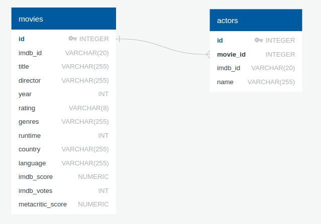

# TD07 : SQL, simulations et dichotomie


{{initexo(0)}}


!!! example "{{ exercice() }}"
    *Extrait du sujet ESCP 2025*

    Un zoo dispose d'une base de données composée de deux tables pour suivre l'évolution des différentes
    espèces d'animaux placés dans des enclos. Chaque espèce est séparée en deux catégories : les enfants et les
    adultes.

    Dans un enclos on trouve une seule catégorie d'une seule espèce d'animal. La base de données a le schéma
    suivant :

    - ```ANIMAUX(Enclos, Espèce, Catégorie, Effectif, Quantité)```  où

        - ```Enclos``` : numéro de l'enclos (type entier) ;  
        - ```Espèce``` : espèce de l'animal (type chaîne) ;
        - ```Catégorie``` : adulte ou enfant (type chaîne) ;
        - ```Effectif``` : nombre d'animaux (type entier) ;
        - ```Quantité``` : quantité de nourriture à donner en kilogramme (type entier) ;

    - ```ALIMENTATION(Espèce, Type, Tarif)```  où

        - ```Espèce``` : espèce de l'animal (clé étrangère vers la table ```ANIMAUX```)(type chaîne) ;
        - ```Type``` : type d'alimentation (type chaîne) ;
        - ```Tarif``` : prix au kilogramme (type entier).


    **Q1.** Quelle clé primaire peut être choisie pour la table ```ANIMAUX```? Justifer votre réponse.

    {{
    correction(False,
    """
    ??? success \"Correction\" 
        L'attribut ```Enclos``` peut être choisi comme clé primaire de la table ```ANIMAUX``` car il est dit dans l'énoncé que dans chaque enclos on trouve une seule catégorie d'une seule espèce d'animal.
    """
    )
    }}

    **Q2.** Écrire une requête SQL qui renvoie la liste des types d'alimentation à utiliser dans le zoo.

    {{
    correction(False,
    """
    ??? success \"Correction\" 
        ```sql
        SELECT Type
        FROM ALIMENTATION
        ```
    """
    )
    }}

    **Q3.** Écrire une requête SQL donnant la liste des espèces d'animaux dont le nombre d'adultes est supérieur ou égal à 6.

    {{
    correction(False,
    """
    ??? success \"Correction\" 
        ```sql
        SELECT Espèce
        FROM ANIMAUX
        WHERE Catégorie = 'adulte' AND Effectif >= 6
        ```
    """
    )
    }}

    **Q4.** Écrire une requête SQL donnant la liste de l'espèce et de l'effectif des animaux dont le prix au kilogramme d'alimentation est inférieur strictement à 15.

    {{
    correction(False,
    """
    ??? success \"Correction\" 
        ```sql
        SELECT ANIMAUX.Espèce, ANIMAUX.Effectif
        FROM ANIMAUX
        INNER JOIN ALIMENTATION ON ALIMENTATION.Espèce = ANIMAUX.Espèce
        WHERE ALIMENATION.Tarif < 15
        ```
    """
    )
    }}

{#
!!! example "{{ exercice() }}"

    [Lien vers le cours de SQL](https://glassus.github.io/ect2/CoursSQL/langage_SQL/){. target="_blank"}

  
    On étudie une base de données sur le cinéma, qui possède deux tables, ```movies``` et ```actors```.

    {: .center width=80%}
    
    - la table ```movies``` possède un attribut ```id``` qui est sa clé primaire.
    - la table ```actors``` possède un attribut ```id``` qui est sa clé primaire. Elle possède aussi un attribut ```movie_id```, qui fait référence à l'attribut ```id``` de la table ```movies```. ```movie_id``` est donc une clé étrangère.     


    !!! note "Question 1"
        Afficher le titre et le nom du réalisateur de tous les films sortis en 2002.

        {!{ sqlide titre="Votre code SQL :"  base="CoursSQL/data/cinema.db", espace="cinema" }!}

        {{
        correction(False,
        """
        ??? success \"Correction\" 
            ```SQL
            SELECT title, director
            FROM movies
            WHERE year = 2002
        
            ```            
        """
        )
        }}


        
        


    !!! note "Question 2"
        
        Afficher le titre et l'année de tous les films réalisés par Steven Spielberg, et dont le ```metacritic_score``` est strictement supérieur à 80.

        {!{ sqlide titre="Votre code SQL :"  base="CoursSQL/data/cinema.db", espace="cinema" }!}

        {{
        correction(False,
        """
        ??? success \"Correction\" 
            ```SQL
            SELECT title, year
            FROM movies
            WHERE director = 'Steven Spielberg'
            AND  metacritic_score > 80
            ```            
        """
        )
        }}
        


        
        

    !!! note "Question 3"
        Afficher le nom de tous les films dans lequel joue l'acteur Henry Fonda.

        {!{ sqlide titre="Votre code SQL :"  base="CoursSQL/data/cinema.db", espace="cinema" }!}

        {{
        correction(False,
        """
        ??? success \"Correction\" 
            ```SQL
            SELECT movies.title
            FROM movies
            INNER JOIN actors ON movies.id = actors.movie_id
            WHERE actors.name = 'Henry Fonda'
            ```            
        """
        )
        }}

#}
        
        

  
!!! note ":heart: :heart: :heart: Syntaxe des lois usuelles :heart: :heart: :heart:"
    Rappel : on utilise les simulateurs de lois du module ```random``` de la bibliothèque ```numpy```.  
    Ceci nécessite systématiquement la présence des deux lignes suivantes au début de chaque script :
    ```python linenums='1'
    import numpy as np
    import numpy.random as rd   
    ```  

    - :arrow_right: **loi uniforme** : 
        - ```rd.random()``` renvoie un réel dans $[0;1]$ qui suit une loi uniforme (chaque réel a la même probabilité d'apparition)
        - ```rd.randint(a,b)``` renvoie un entier dans $[a;b[$ qui suit une loi uniforme (chaque entier a la même probabilité d'apparition). Attention, la valeur $b$ n'est pas prise. Ce qui signifie que pour un tirage aléatoire uniforme de 0 et de 1, il faut utiliser l'expression ```rd.randint(0,2)```.

    - :arrow_right: **loi binomiale** : ```rd.binomial(n,p)``` renvoie un entier qui suit une loi binomiale de paramètre $(n,p)$. ($n$ répétitions d'une épreuve de Bernoulli de paramètre $p$)

    - :arrow_right: **loi géométrique** : ```rd.geometric(p)``` renvoie un entier qui suit une loi géométrique de paramètre $p$ (nombre d'expériences de Bernoulli de paramètre $p$ avant l'apparition du premier succès)

    - :arrow_right: **loi exponentielle** : ```rd.exponential(1/lambda)``` renvoie un réel qui suit une loi exponentielle de paramètre ```lambda```.


    :star: Comment renvoyer un **vecteur** plutôt qu'une seule valeur unique ? Il suffit de rajouter le nombre de simulations désirées comme dernier paramètre dans la parenthèse.

    **Exemple :**  
    Pour simuler 10 tirages aléatoires de nombres égaux à 0 ou à 1, on utilisera :
    ```python
    >>> X = rd.randint(0,2,10)
    >>> X
    array([0, 1, 0, 0, 1, 0, 0, 0, 1, 1])
    ```

    Pour connaître la valeur du 5ème tirage, on appelera :
    ```python
    >>> X[4]
    1
    ```
    :warning: Ne pas oublier qu'on commence à indexer à 0, donc le 5ème élément est l'élément d'indice 4...


:arrow_right: [Lien pour ouvrir une console Python dans un nouvel onglet](https://console.basthon.fr/){. target="_blank"} (sous Chrome de préférence)


!!! example "{{ exercice() }}"
    *d'après Ecricome 2020*

    Un bureau de poste dispose de deux guichets. Trois clients notés $A$, $B$, $C$ arrivent en même temps. Les clients $A$ et $B$ se font servir tandis que $C$ attend, puis effectue son opération dès que l’un des deux
    guichets se libère.
    On définit les variables aléatoires $X$, $Y$, $Z$ égales à la durée en minutes de l’opération des clients $A$, $B$
    et $C$ respectivement lorsqu’ils sont au guichet.
    On fixe $a$ et $b$ deux réels strictement positifs, et on suppose que $X$ suit une loi exponentielle de paramètre $a$, et que $Y$ suit une loi exponentielle de paramètre $b$.

    On suppose enfin que $X$ et $Y$ sont indépendantes.


    On note $T$ la variable aléatoire égale au temps d'attente en minutes du client $C$ avant de parvenir à un des guichets. La variable aléatoire $T$ prend donc **la plus petite** des valeurs prises par $X$ et $Y$.

    On rappelle que, pour `n` un entier naturel non nul, et `lambda` un réel strictement positif, l'instruction `rd.exponential(1/lambda, n)` simule `n` fois une variable aléatoire de loi exponentielle de paramètre `lambda` et stocke les `n` réalisations ainsi obtenues dans un vecteur de taille `n`.

    On considère le code Python suivant :

    ```python linenums='1'
    import numpy as np
    import numpy.random as rd

    def simul(a, b):
        X = rd.exponential(1/a, 10000)
        Y = rd.exponential(1/b, 10000)
        T = X
        for k in range(10000):
            if ... > ...:
                T[k] = ...
        return T

    ```
    **Q1.** Compléter le code de la fonction `simul` pour qu'elle construise un vecteur `T` contenant 10000 réalisations de la variable aléatoire $T$.

    {{
    correction(False,
    """
    ??? success \"Correction\" 
        ```python linenums='1' hl_lines='9 10'
        import numpy as np
        import numpy.random as rd

        def simul(a, b):
            X = rd.exponential(1/a, 10000)
            Y = rd.exponential(1/b, 10000)
            T = X
            for k in range(10000):
                if X[k] > Y[k]:
                    T[k] = Y[k]
            return T
        ```        
    """
    )
    }}


    

    Dans toute la suite de l'exercice, on suppose $a=b=\frac{1}{2}$, et on suppose que la variable aléatoire $Z$ suit une loi exponentielle, de paramètre 1, la variable aléatoire $Z$ étant indépendante de $X$ et $Y$.

    On s'intéresse à $V=T+Z$ qui représente le temps total passé par le client $C$ dans la poste, attente et service compris.

    On s'intéresse à la fonction Python suivante :

    ```python linenums='1'
    def simul2():
        T = simul(1/2, 1/2)
        Z = rd.exponential(1, 10000)
        n = 0
        for k in range(10000):
            if T[k] + Z[k] > 2:
                n = n + 1
        return n / 10000
    ```

    On lance la fonction `simul2` plusieurs fois de suite, et on obtient les résultats suivants : 

    ```
    0.4045
    0.4151
    0.4221
    0.4096
    0.4188
    ```

    **Q2.** Que retourne la fonction `simul2` ? On pourra utiliser la définition de la variable aléatoire $V$.  

    {{
    correction(False,
    """
    ??? success \"Correction\" 
        La fonction `simul2` retourne la fréquence avec laquelle la variable aléatoire $V$ prend des valeurs supérieures à 2. Sur une simulation de très grande taille, cette fréquence va donc se rapprocher de la valeur $P(V>2)$.        
    """
    )
    }}
    

    

    On admet que $V$ est encore une variable aléatoire à densité, admettant pour densité la fonction $g$ définie par  :


    $$
    \forall x \in \mathbb{R}, \quad g(x)=
    \left\{
    \begin{array}[l]{l}
    0 \qquad \text{ si } x<0 \\
    x e^{-x} \quad \text{   si } x \geqslant 0
    \end{array}
    \right.
    $$

    **Q3.** À l'aide d'une intégration par parties, montrer que pour tout réel $A>0$ :

    $$ \int_0^A g(x)dx = 1-e^{-A}-Ae^{-A}$$

    {{
    correction(False,
    """
    ??? success \"Correction\" 
        $\\int_0^A g(x)dx = \\big[ -x e^{-x} \\big]_0^A - \\int_0^A -e^{-x}dx=-Ae^{-A}-\\big[e^{-x} \\big]_0^A=-Ae^{-A}-e^{-A}+1=1-e^{-A}-Ae^{-A}$
    """
    )
    }}
    
        
    

    **Q4.** Vérifier que $g$ est bien une densité de probabilité.
    
        {{
    correction(False,
    """
    ??? success \"Correction\" 
        $\\int_{-\\infty}^{+\\infty} g(x)dx = \\int_{0}^{+\\infty} g(x)dx = \\lim\limits_{A \\to + \\infty} \\int_0^A g(x)dx = \\lim\limits_{A \\to + \\infty} 1-e^{-A}-Ae^{-A}=1$

        De plus, $g$ est bien positive et continue (elle est continue en 0).

        Donc $g$ est bien une densité de probabilité.
    """
    )
    }}
 

    

    **Q5.** Calculer $P(V \leqslant 2)$. En déduire la valeur de $P(V>2)$.
    
        {{
    correction(False,
    """
    ??? success \"Correction\" 
        $P(V \\leqslant 2)=\\int_{-\\infty}^{2} g(x)dx=\\int_{0}^{2} g(x)dx=1-e^{-2}-2e^{-2}$.  
        Donc $P(V>2)=1-P(V \\leqslant 2)=e^{-2}+2e^{-2}=3e^{-2} \\approx 0,406$
    """
    )
    }}


    


    **Q6.** Ce résultat est-il cohérent avec les résultats Python de la question 2. ?
    
        {{
    correction(False,
    """
    ??? success \"Correction\" 
        La valeur théorique de $P(V>2)$ est conforme aux valeurs empiriques trouvées par simulation à la question 1 et 2.
    """
    )
    }}
       
    


!!! example "{{ exercice() }}"
    
    :heart: **Algorithme de dichotomie** :heart:

    On considère la fonction $f(x) = x^3 + 2x -4$.

    On souhaite résoudre par dichotomie l'équation $f(x) = 0$.

    **Q1.** Compléter le code ci-dessous pour qu'il trace la fonction $f$ sur $[-5,5]$.

    ```python linenums='1'
    import matplotlib.pyplot as plt
    import numpy as np

    def f(x):
        return ...

    X = np.linspace(..., ..., 100)
    Y = ...

    plt.axhline(0, color='black', linewidth=0.5, linestyle='--')
    plt.axvline(0, color='black', linewidth=0.5, linestyle='--')
    plt.plot(X,Y)

    plt.show()
    ```

    {{
    correction(False,
    """
    ??? success \"Correction\" 
        ```python linenums='1'
        import matplotlib.pyplot as plt
        import numpy as np

        def f(x):
            return x**3 + 2*x - 4

        X = np.linspace(-5, 5, 100)
        Y = f(X)

        plt.axhline(0, color='black', linewidth=0.5, linestyle='--')
        plt.axvline(0, color='black', linewidth=0.5, linestyle='--')
        plt.plot(X,Y)

        plt.show()
        ``` 
    """
    )
    }}

    **Q2.** Montrer que l'équation $f(x) = 0$ admet une solution unique $\alpha$ sur l'intervalle $[0,2]$.

    {{
    correction(False,
    """
    ??? success \"Correction\" 
        $f'(x) = 3x^2 + 2$

        $f'$ est strictement positive, donc $f$ est strictement croissante sur $\\mathbb{R}$.
        Comme $f(0) = -4$ et $f(2) = 6$, l'équation $f(x) = 0$ admet une solution unique sur $[0,2]$.
    """
    )
    }}


    

    **Q3.** Compléter le code ci-dessous pour qu'il affiche, avec une précision de $10^{-3}$, la valeur de $\alpha$.

    ```python linenums='1'
    def f(x):
        return ...

    a = ...
    b = ...
    while ...:
        m = ...
        if ... < ...:
            ... = ...
        else:
            ... = ...
    print(m)
    ```

    {{
    correction(False,
    """
    ??? success \"Correction\" 
        ```python linenums='1'
        def f(x):
            return x**3 + 2*x - 4

        a = 0
        b = 2
        while b - a > 10**(-3):
            m = (a + b) / 2
            if f(a) * f(m) < 0:
                b = m
            else:
                a = m
        print(m)
        ```       
    """
    )
    }}

!!! example "{{ exercice() }}"

    Antoine et Béatrice jouent au Badminton. On suppose que lors de chaque échange, le
    joueur qui a le service emporte le point avec une probabilité $\frac{2}{3}$ et le perd avec une
    probabilité $\frac{1}{3}$.

    On suppose que c’est Antoine qui a le service lors du premier échange. Ensuite, selon
    les règles de ce jeu, celui qui emporte l’échange marque un point et obtient le service
    pour l’échange suivant.


    On souhaite simuler 20 échanges (incluant le premier où Antoine sert), et afficher le nombre de points marqués par Antoine.

    ```python linenums='1'
    import numpy as np
    import numpy.random as rd

    a = ...
    points = ...
    for k in range(19):
        if a == ...:
            a = ...
        else:
            a = ...
        ... = ... + ...
    print(...) 
    ```


    {{
    correction(False,
    """
    ??? success \"Correction\" 
        ```python linenums='1'
        import numpy as np
        import numpy.random as rd

        a = rd.binomial(1, 2/3)
        points = a
        for k in range(19):
            if a == 1:
                a = rd.binomial(1,2/3)
            else:
                a = rd.binomial(1,1/3)
            points = points + a
        print(points) 
        ```

    """
    )
    }}

!!! example "{{ exercice() }}"

    Écrire un code où l'utilisateur doit deviner un nombre choisi aléatoirement par l'ordinateur entre 1 et 100. L'utilisateur devra être guidé après chaque proposition par les instructions *«trop grand»* ou *«trop petit»*.

    :material-lifebuoy: *aide :*

    ```python linenums='1'
    import numpy as np
    import numpy.random as rd

    nb_secret = ...

    prop = int(input("proposition ? "))
    while ...
    ```

    {{
    correction(False,
    """
    ??? success \"Correction\" 
        ```python linenums='1'
        import numpy as np
        import numpy.random as rd

        nb_secret = rd.randint(1,101)

        prop = int(input('proposition ? '))
        while prop != nb_secret:
            if prop > nb_secret:
                print('trop grand')
            else:
                print('trop petit')
            prop = int(input('proposition ? '))

        print('bravo !')
        ```
    """
    )
    }}
