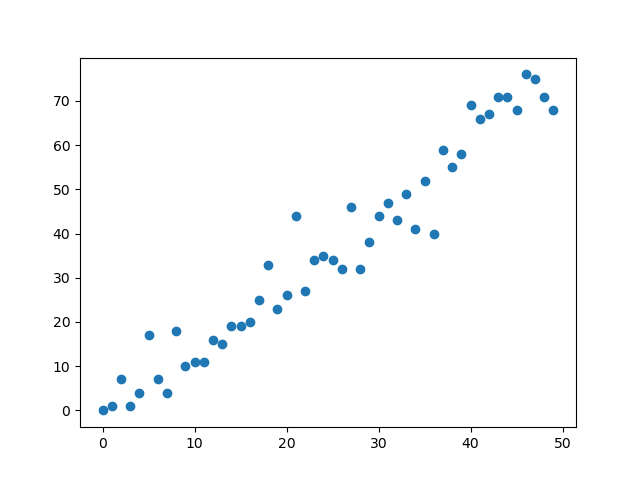
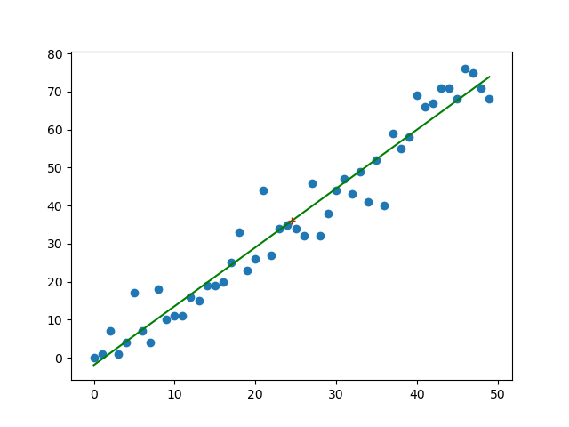
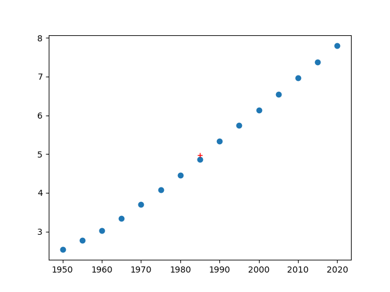
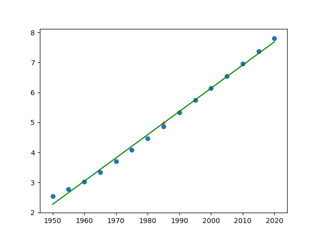

# TD08 : SQL, matrices, régression, simulations


{{initexo(0)}}

## 1. Entraînement SQL

!!! abstract "{{ exercice() }}"

    [Lien vers le cours de SQL](https://glassus.github.io/ect2/CoursSQL/langage_SQL/){. target="_blank"}

  
    On étudie (encore) une base de données sur le cinéma, qui possède deux tables, ```movies``` et ```actors```.

    {: .center width=80%}
    
    - la table ```movies``` possède un attribut ```id``` qui est sa clé primaire.
    - la table ```actors``` possède un attribut ```id``` qui est sa clé primaire. Elle possède aussi un attribut ```movie_id```, qui fait référence à l'attribut ```id``` de la table ```movies```. ```movie_id``` est donc une clé étrangère.     


    !!! note "Question 1"
        Afficher le titre et le nom du réalisateur de tous les films **français**.

        {!{ sqlide titre="Votre code SQL :"  base="CoursSQL/data/cinema.db", espace="cinema" }!}

        {{
        correction(True,
        """
        ??? success \"Correction\" 
            ```SQL
            SELECT title, director
            FROM movies
            WHERE country = 'France'
        
            ``` 
        """
        )
        }}


        
        


    !!! note "Question 2"
        
        Le titre du film «Intouchables» de Nakache et Toledano apparaît comme «The Intouchables». Modifier ce titre pour qu'il apparaisse sous le nom «Intouchables».

        {!{ sqlide titre="Votre code SQL :"  base="CoursSQL/data/cinema.db", espace="cinema" }!}


        Vérifier si votre modification est correcte :

        {!{ sqlide titre="Votre code SQL :"  base="CoursSQL/data/cinema.db", espace="cinema" }!}


        {{
        correction(True,
        """
        ??? success \"Correction\" 
            ```SQL
            UPDATE movies
            SET title = 'Intouchables'
            WHERE title = 'The Intouchables'
            ``` 
        """
        )
        }}


        
        

    !!! note "Question 3"
        Le réalisateur Carl Theodor Dreyer est un réalisateur Danois qui est manifestement là par erreur. Supprimer totalement de la table ```movies``` tous les films de ce réalisateur.

        {!{ sqlide titre="Votre code SQL :"  base="CoursSQL/data/cinema.db", espace="cinema" }!}


        

        
        Vérifier si votre modification est correcte :

        {!{ sqlide titre="Votre code SQL :"  base="CoursSQL/data/cinema.db", espace="cinema" }!}

        {{
        correction(True,
        """
        ??? success \"Correction\" 
            ```SQL
            DELETE FROM movies
            WHERE director = 'Carl Theodor Dreyer'
            ```            
        """
        )
        }}

    !!! note "Question 4"
        Afficher le titre, le réalisateur et l'année de tous les films dans lesquels a joué l'acteur Mathieu Kassovitz depuis l'année 2000.

        {!{ sqlide titre="Votre code SQL :"  base="CoursSQL/data/cinema.db", espace="cinema" }!}

        {{
        correction(True,
        """
        ??? success \"Correction\" 
            ```SQL
            SELECT movies.title, movies.director, movies.year 
            FROM movies
            INNER JOIN actors ON movies.id = actors.movie_id
            WHERE actors.name = 'Mathieu Kassovitz'  AND movies.year >= 2000   
            ```            
        """
        )
        }}


        

## 2. Retour sur les matrices

:arrow_right: [Lien pour ouvrir une console Python dans un nouvel onglet](https://console.basthon.fr/){. target="_blank"}

!!! note ":heart: :heart: :heart: Syntaxe des opérations matricielles :heart: :heart: :heart:"
    :arrow_right: **Saisir une matrice**  
    La matrice 
    $A=\begin{pmatrix}
    1 & 2 & 3 \\
    4 & 5 & 6 \\
    7 & 8 & 9
    \end{pmatrix}$
    se saisira par le code suivant :
    ```python 
    import numpy as np
    A = np.array([[1, 2, 3], [4, 5, 6], [7, 8, 9]])
    ```

    :arrow_right: **Saisir un vecteur-ligne**  
    Le vecteur 
    $X=\begin{pmatrix}
    1 & 2 & 3 
    \end{pmatrix}$
    se saisira par le code suivant :
    ```python
    X = np.array([1, 2, 3])
    ```

    :arrow_right: **Saisir un vecteur-colonne**  
    Le vecteur 
    $X=\begin{pmatrix}
    1 \\
    2 \\
    3 
    \end{pmatrix}$
    se saisira par le code suivant :
    ```python
    X = np.array([[1], [2], [3]])
    ```

    :arrow_right: **Effectuer un produit matriciel**  
    Le calcul du produit matriciel $A \times X$ se fera par l'instruction ```np.dot(A, X)``` :  
    ```python
    >>> np.dot(A, X)
    array([[14],
           [32],
           [50]])
    ```


!!! abstract "{{ exercice() }}"
    *d'après le sujet 0 n°2 Ecricome 2023*

    On note
    $B=\begin{pmatrix}
    -1 & 4 & -1 \\
    -2 & 5 & 2 \\
    0 & 0 & -2
    \end{pmatrix}$,
    $P=\begin{pmatrix}
    1 & 2 & 1 \\
    0 & 1 & 1 \\
    1 & 0 & 0
    \end{pmatrix}$,
    $Q=\begin{pmatrix}
    0 & 0 & 1 \\
    1 & -1 & -1 \\
    -1 & 2 & 1
    \end{pmatrix}$ et
    $D=\begin{pmatrix}
    -2 & 0 & 0 \\
    0 & 1 & 0 \\
    0 & 0 & 3
    \end{pmatrix}$,

    **Q1.** Créer en Python la variable ```B``` correspondant à la matrice $B$, ainsi que les variables ```X1```, ```X2```, ```X3``` correspondant respectivement aux vecteurs $X_1$, $X_2$ et $X_3$ ci-dessous :

    $X_1=\begin{pmatrix}
    1  \\
    0  \\
    1 
    \end{pmatrix}$,
    $X_2=\begin{pmatrix}
    2  \\
    1  \\
    0 
    \end{pmatrix}$,
    $X_3=\begin{pmatrix}
    1  \\
    1  \\
    0 
    \end{pmatrix}$
    
    

    {{
    correction(True,
    """
    ??? success \"Correction\" 
        ```python linenums='1'
        import numpy as np

        B = np.array([[-1, 4, -1], [-2, 5, 2], [0, 0, -2]])
        X1 = np.array([[1], [0], [1]])
        X2 = np.array([[2], [1], [0]])
        X3 = np.array([[1], [1], [0]])
        ```        
    """
    )
    }}


    


    **Q2.** Par des calculs en Python, montrer que les vecteurs $X_1$, $X_2$ et $X_3$ sont des vecteurs propres de la matrice $B$, et préciser pour chacun la valeur propre associée.

    {{
    correction(True,
    """
    ??? success \"Correction\" 
        ```python
        >>> np.dot(B, X1)
        array([[-2],  [0], [-2]])
        >>> np.dot(B, X2)
        array([[2], [1], [0]])
        >>> np.dot(B, X3)
        array([[3], [3], [0]])
        ```
        On en déduit que :
        
        - $BX_1 = 2X_1$, donc $X_1$ est un vecteur propre associé à la valeur propre 2.
        - $BX_2 = X_2$, donc $X_2$ est un vecteur propre associé à la valeur propre 1.
        - $BX_3 = 3X_3$, donc $X_3$ est un vecteur propre associé à la valeur propre 3.
            
    """
    )
    }}

    ??? tip "De l'intérêt de bien calculer les valeurs propres et vecteurs propres"
        - [https://www.youtube.com/watch?v=47cPhhywvOo](https://www.youtube.com/watch?v=47cPhhywvOo){. target="_blank"}
        - [https://www.youtube.com/watch?v=XggxeuFDaDU](https://www.youtube.com/watch?v=XggxeuFDaDU){. target="_blank"}
        - [https://www.sciencesetavenir.fr/high-tech/le-millenium-bridge-victime-d-une-danse-synchronisee_35143](https://www.sciencesetavenir.fr/high-tech/le-millenium-bridge-victime-d-une-danse-synchronisee_35143){. target="_blank"}
    
    **Q3.** On considère le script Python suivant :
    ```python linenums='1'
    import numpy as np

    I = np.eye(3)
    B = np.array([[-1, 4, -1], [-2, 5, 2], [0, 0, -2]])
    P = np.array([[1, 2, 1], [0, 1, 1], [1, 0, 0]])
    Q = np.array([[0, 0, 1], [1, -1, -1], [-1, 2, 1]])
    R = np.dot(P, Q) - I
    S = np.dot(Q, np.dot(B, P))

    print(R)
    print(S)
    ```
    À son exécution, on obtient :
    ```python
    [[0. 0. 0.]
     [0. 0. 0.]
     [0. 0. 0.]]
    [[-2  0  0]
     [ 0  1  0]
     [ 0  0  3]]
    ```

    Que peut-on en conjecturer sur la matrice $P$ ? sur la matrice $D$ ?

    {{
    correction(False,
    """
    ??? success \"Correction\" 
        - On remarque que la matrice $R$ est une matrice nulle. Comme $R=PQ-I$, cela signifie que $PQ=I$ et donc que $P$ et $Q$ sont deux matrices inverses.  

        - On remarque que la matrice $S$ est égale à la matrice $D$. Donc $D=QBP=P^{-1}BP$.  
        Or la matrice $P$ est formée des trois vecteurs propres $X_1$, $X_2$ et $X_3$ de la matrice $B$, c'est donc sa matrice de passage. Le calcul $P^{-1}BP$ va donc donner la matrice diagonale associée à $B$.  
        On reconnaît d'ailleurs que $D$ est bien formée des 3 valeurs propres trouvées à la question précédente.
            
    """
    )
    }}


## 3. Régression linéaire

!!! note "Coefficient de corrélation linéaire de deux variables aléatoires"
    :arrow_right: **Définition**  
    Le coefficient de corrélation linéaire de deux variables aléatoires $X$ et $Y$ est le réel $\rho(X,Y)$ donné par la formule :
                
    $$\rho(X,Y) = \dfrac{Cov(X,Y)}{\sqrt{V(X)}\sqrt{V(Y)}}$$

    :arrow_right: **Interprétation**   

    - Si $X$ et $Y$ sont indépendantes, alors $\rho(X,Y) = 0$
    - Si $X$ et $Y$ sont liées par une combinaison linéaire (ex : $Y = 3X+2$), alors $\rho(X,Y) = \pm 1$

    :arrow_right: **Utilisation en statistiques**   
    Lorsque $\rho$ est *proche* de 1, on peut conjecturer que le phénomène observé est prédictible. Le tracé de la droite de régression permet alors de faire des prévisions.

    :warning: Cet outil sert à montrer une *corrélation*. Mais **corrélation n'est pas causalité** ! 
    
    Observez [https://www.tylervigen.com/spurious-correlations](https://www.tylervigen.com/spurious-correlations){. target="_blank"}


!!! note "Syntaxe Python :heart: :heart: :heart:"
    
    :arrow_right: **Calcul du coefficient de corrélation :** ```np.corrcoef(x, y)[0, 1]```

    Considérons le code suivant :

    ```python linenums='1'
    import numpy as np
    import matplotlib.pyplot as plt
    plt.clf()

    x = np.arange(0, 50, 1) 
    # permet de construire facilement un vecteur ligne avec tous les nombres
    # de 0 à 49 (progression avec un pas de 1)

    y = np.array([ 0,  1,  7,  1,  4, 17,  7,  4, 18, 10, 11, 11, 16, 15, 19, 19, 20,
           25, 33, 23, 26, 44, 27, 34, 35, 34, 32, 46, 32, 38, 44, 47, 43, 49,
           41, 52, 40, 59, 55, 58, 69, 66, 67, 71, 71, 68, 76, 75, 71, 68])

    coeff = np.corrcoef(x, y)[0, 1]

    plt.scatter(x, y)
    print(coeff)

    plt.show()
    ```

    Le tracé laisse apparaître une distribution des points qui semblent être situés autour d'une droite. Ceci est confirmé par le calcul du coefficient de corrélation linéaire (:heart: **calculé par l'instruction** ```np.corrcoef(x,y)[0,1]``` :heart: )

    ```python
    >>> np.corrcoef(x,y)[0,1]
    0.9732489445263028
    ```

    {: .center}

    :arrow_right: **Calcul et tracé du point moyen :** ```np.mean(x)```

    La fonction ```np.mean(x)``` permet de calculer la valeur moyenne d'un ensemble de valeurs stockées dans la variable ```x```.

    Le point moyen d'une série statistique double peut donc se tracer par :
    ```python
    plt.plot([np.mean(x)], [np.mean(y)], 'r+') 
    ```

    {: .center}


    :arrow_right: **Tracé de la droite de régression :** ```a, b = np.polyfit(x, y, 1)```

    - Le calcul du coefficient directeur ```a``` et de l'ordonnée à l'origine ```b``` de la droite de régression se fait par la commande  :heart: ```a, b = np.polyfit(x, y, 1)``` :heart:
    - Le tracé de la droite se fait par `plt.plot(x, a*x + b)`


    Insérer les lignes :
    ```python
    a, b = np.polyfit(x, y, 1)
    plt.plot(x, a*x + b, 'g-')
    ```
    dans le code précédent. On obtient alors :
    {: .center}


!!! abstract "{{ exercice() }}"
    *d'après Mathématiques Dunod*

    En 2019, l'ONU prévoyait que la population mondiale attendrait 10 milliards d'habitants en 2057. On se propose de vérifier ce résultat.  
    L'évolution de la population mondiale depuis 1950 est donnée dans le tableau ci-dessous (en haut : l'année, en bas : la population en milliards d'habitants)

    |1950|1955|1960|1965|1970|1975|1980|1985|1990|1995|2000|2005|2010|2015|2020|
    |:--:|:--:|:--:|:--:|:--:|:--:|:--:|:--:|:--:|:--:|:--:|:--:|:--:|:--:|:--:|
    |2,54|2,77|3,03|3,34|3,70|4,08|4,46|4,87|5,33|5,74|6,14|6,54|6,96|7,38|7,80|

    On note $X$ et $Y$ les variables égales respectivement à l'année et au nombre d'habitants dans le monde (en milliards). On note $x$ et $y$ les séries statistiques respectivement associées.

    **Q1.** Écrire les commandes Python permettant de représenter le nuage de points associé à la série double $(x,y)$ et marquer le point moyen du nuage par une croix rouge.

    On pourra utiliser la liste
    
    ```python linenums='1'
    [2.54, 2.77, 3.03, 3.34, 3.70, 4.08, 4.46, 4.87, 5.33, 5.74, 6.14, 6.54, 6.96, 7.38, 7.80]
    ```
    
    pour créer la série $y$. 
    
    {{
    correction(False,
    """
    ??? success \"Correction\" 
        ```python linenums='1'
        import numpy as np
        import matplotlib.pyplot as plt

        x = np.arange(1950, 2025, 5)
        y = np.array([2.54, 2.77, 3.03, 3.34, 3.70, 4.08, 4.46, 4.87, 5.33, 5.74, 6.14, 6.54, 6.96, 7.38, 7.80])

        plt.scatter(x,y)
        plt.plot([np.mean(x)], [np.mean(y)], 'r+') 

        plt.show()
        ```
        {: .center}         
    """
    )
    }}

   

    **Q2.** Prévoir le signe du coefficient de corrélation linéaire de la série double $(x,y)$.

    {{
    correction(False,
    """
    ??? success \"Correction\" 
        Plus l'année augmente, plus la population augmente : $\\rho$ sera donc positif.
    """
    )
    }}


    **Q3.** Calculer le coefficient de corrélation linéaire et tracer la droite de régression.

    {{
    correction(False,
    """
    ??? success \"Correction\" 
        ```python linenums='1'
        import numpy as np
        import matplotlib.pyplot as plt

        x = np.arange(1950, 2025, 5)
        y = np.array([2.54, 2.77, 3.03, 3.34, 3.70, 4.08, 4.46, 4.87, 5.33, 5.74, 6.14, 6.54, 6.96, 7.38, 7.80])


        coeff = np.corrcoef(x, y)[0, 1]

        a, b = np.polyfit(x, y, 1)
        plt.plot(x, a*x + b, color='green')

        plt.scatter(x, y)
        plt.plot([np.mean(x)], [np.mean(y)], 'r+') 
        print(coeff)


        plt.show()
        ```
        
        Coefficient de corrélation linéaire :
        ```python
        >>> coeff
        0.9979169799754183
        ```

        {: .center}        
    """
    )
    }}

    
 
    **Q4.** À l'aide des coefficients $a$ et $b$ de la droite de régression, conjecturer la population mondiale en 2050 et vérifier la prévision de l'ONU.

    {{
    correction(False,
    """
    ??? success \"Correction\" 
        ```python
        >>> a
        0.07745714285714277
        >>> b
        -148.77376190476173
        >>> a*2050 + b
        10.013380952380942
        ```

        La prévision de l'ONU est donc compatible avec notre simulation.        
    """
    )
    }}


    


## 4. Retour sur les simulations


!!! note ":heart: :heart: :heart: Syntaxe des lois usuelles :heart: :heart: :heart:"
    Rappel : on utilise les simulateurs de lois du module ```random``` de la bibliothèque ```numpy```.  
    Ceci nécessite systématiquement la présence des deux lignes suivantes au début de chaque script :
    ```python linenums='1'
    import numpy as np
    import numpy.random as rd   
    ```  

    - :arrow_right: **loi uniforme** : 
        - ```rd.random()``` renvoie un réel dans $[0;1]$ qui suit une loi uniforme (chaque réel a la même probabilité d'apparition)
        - ```rd.randint(a,b)``` renvoie un entier dans $[a;b[$ qui suit une loi uniforme (chaque entier a la même probabilité d'apparition). Attention, la valeur $b$ n'est pas prise. Ce qui signifie que pour un tirage aléatoire uniforme de 0 et de 1, il faut utiliser l'expression ```rd.randint(0,2)```.

    - :arrow_right: **loi binomiale** : ```rd.binomial(n,p)``` renvoie un entier qui suit une loi binomiale de paramètre $(n,p)$. ($n$ répétitions d'une épreuve de Bernoulli de paramètre $p$)

    - :arrow_right: **loi géométrique** : ```rd.geometric(p)``` renvoie un entier qui suit une loi géométrique de paramètre $p$ (nombre d'expériences de Bernoulli de paramètre $p$ avant l'apparition du premier succès)

    - :arrow_right: **loi exponentielle** : ```rd.exponential(1/lambda)``` renvoie un réel qui suit une loi exponentielle de paramètre ```lambda```.


    :star: Comment renvoyer un **vecteur** plutôt qu'une seule valeur unique ? Il suffit de rajouter le nombre de simulations désirées comme dernier paramètre dans la parenthèse.

    **Exemple :**  
    Pour simuler 10 tirages aléatoires de nombres égaux à 0 ou à 1, on utilisera :
    ```python
    >>> X = rd.randint(0,2,10)
    >>> X
    array([0, 1, 0, 0, 1, 0, 0, 0, 1, 1])
    ```

    Pour connaître la valeur du 5ème tirage, on appelera :
    ```python
    >>> X[4]
    1
    ```
    :warning: Ne pas oublier qu'on commence à indexer à 0, donc le 5ème élément est l'élément d'indice 4...


:arrow_right: [Lien pour ouvrir une console Python dans un nouvel onglet](https://console.basthon.fr/){. target="_blank"} (sous Chrome de préférence)

   


!!! abstract "{{ exercice() }}"

    Antoine et Béatrice jouent au Badminton. On suppose que lors de chaque échange, le
    joueur qui a le service emporte le point avec une probabilité $\dfrac{2}{3}$ et le perd avec une
    probabilité $\dfrac{1}{3}$.

    On suppose que c’est Antoine qui a le service lors du premier échange. Ensuite, selon
    les règles de ce jeu, celui qui emporte l’échange marque un point et obtient le service
    pour l’échange suivant.


    On souhaite simuler 20 échanges (incluant le premier où Antoine sert), et afficher le nombre de points marqués par Antoine.

    ```python linenums='1'
    import numpy as np
    import numpy.random as rd

    a = ...
    points = ...
    for k in range(19):
        if a == ...:
            a = ...
        else:
            a = ...
        ... = ... + ...
    print(...) 
    ```


    {{
    correction(False,
    """
    ??? success \"Correction\" 
        ```python linenums='1'
        import numpy as np
        import numpy.random as rd

        a = rd.binomial(1, 2/3)
        points = a
        for k in range(19):
            if a == 1:
                a = rd.binomial(1,2/3)
            else:
                a = rd.binomial(1,1/3)
            points = points + a
        print(points) 
        ```

    """
    )
    }}

!!! abstract "{{ exercice() }}"

    Écrire un code où l'utilisateur doit deviner un nombre choisi aléatoirement par l'ordinateur entre 1 et 100. L'utilisateur devra être guidé après chaque proposition par les instructions *«trop grand»* ou *«trop petit»*.

    :material-lifebuoy: *aide :*

    ```python linenums='1'
    import numpy as np
    import numpy.random as rd

    nb_secret = ...

    prop = int(input("proposition ? "))
    while ...
    ```

    {{
    correction(False,
    """
    ??? success \"Correction\" 
        ```python linenums='1'
        import numpy as np
        import numpy.random as rd

        nb_secret = rd.randint(1,101)

        prop = int(input('proposition ? '))
        while prop != nb_secret:
            if prop > nb_secret:
                print('trop grand')
            else:
                print('trop petit')
            prop = int(input('proposition ? '))

        print('bravo !')
        ```
    """
    )
    }}


