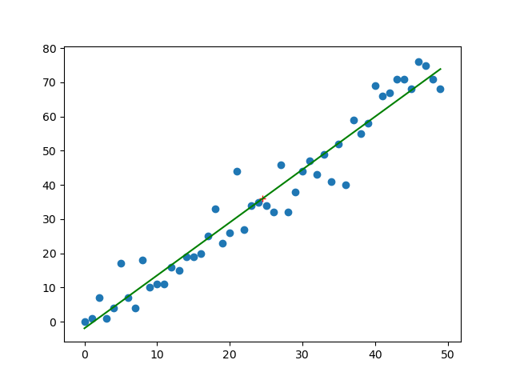

# TD09 : SQL, régression, simulations


{{initexo(0)}}

## 1. Entraînement SQL

!!! abstract "{{ exercice() }}"

    [Lien vers le cours de SQL](https://glassus.github.io/ect2/CoursSQL/langage_SQL/){. target="_blank"}

  
    On étudie une base de données ```parc```, relative à un parc automobile.  
    Cette base possède deux tables, ```personnes``` et ```voitures```.

     
    - la table ```personnes``` possède comme attributs :
        - ```id``` : un numéro d'identification unique pour chaque personne.
        - ```nom```, ```prenom```, ```code_postal```, ```ville``` 

    - la table ```voitures``` possède  comme attributs :
        - ```immatriculation``` : le numéro d'immatriculation unique pour chaque voiture
        - ```modele```, ```marque```, ```couleur```
        - ```proprietaire``` : cet attribut fait référence à l'attribut ```id``` de la table ```personnes```.      

    !!! note "Questions 0"
        1. Quel rôle joue l'attribut ```immatriculation``` dans la table ```voitures``` ?  
        2. Quel rôle joue l'attribut ```proprietaire``` dans la table ```voitures``` ? 
        
        {{
        correction(True,
        """
        ??? success \"Correction\" 
            1. ```immatriculation``` est la clé **primaire** la table ```voitures```. 
            2. ```proprietaire``` une clé **étrangère** de la table ```voitures```, elle fait référence à la clé primaire ```id``` de la table ```personnes```.            
        """
        )
        }}
 
        


    !!! note "Question 1"
        Afficher tout le contenu de la table ```personnes```.

        {!{ sqlide titre="Votre code SQL :"  base="CoursSQL/data/parc.db", espace="parc"}!}

        {{
        correction(True,
        """
        ??? success \"Correction\" 
            ```SQL
            SELECT *
            FROM personnes     
            ```            
        """
        )
        }}


        

    !!! note "Question 2"
        Afficher tout le contenu de la table ```voitures```.

        {!{ sqlide titre="Votre code SQL :"  base="CoursSQL/data/parc.db", espace="parc"}!}

        {{
        correction(True,
        """
        ??? success \"Correction\" 
            ```SQL
            SELECT *
            FROM voitures     
            ```              
        """
        )
        }}        


        

    !!! note "Question 3"
        Donner la plaque d'immatriculation de la voiture rose.

        {!{ sqlide titre="Votre code SQL :"  base="CoursSQL/data/parc.db", espace="parc"}!}

        {{
        correction(True,
        """
        ??? success \"Correction\" 
            ```SQL
            SELECT immatriculation 
            FROM voitures
            WHERE couleur = 'Rose'     
            ```  

            ou bien
            ```SQL
            SELECT immatriculation 
            FROM voitures
            WHERE couleur LIKE 'rose'     
            ```            

        """
        )
        }}        


        


    !!! note "Question 4"
        Insérer dans la table ```personnes``` l'individu Gerard Berry, habitant à Bordeaux (33000) ayant pour ```id``` la valeur 5. 

        {!{ sqlide titre="Votre code SQL :"  base="CoursSQL/data/parc.db", espace="parc"}!}

        Pour vérifier si la table a bien été modifiée :

        {!{ sqlide titre="Votre code SQL :"  base="CoursSQL/data/parc.db", espace="parc"}!}

        {{
        correction(True,
        """
        ??? success \"Correction\" 
            ```SQL
            INSERT INTO personnes
            VALUES (5, 'Berry', 'Gérard', 33000, 'Bordeaux')     
            ```              
        """
        )
        }}        


        


    !!! note "Question 5"
        Donner le nom et le prénom du propriétaire de la Porsche.

        {!{ sqlide titre="Votre code SQL :"  base="CoursSQL/data/parc.db", espace="parc"}!}

        {{
        correction(True,
        """
        ??? success \"Correction\" 
            ```SQL
            SELECT personnes.nom, personnes.prenom 
            FROM personnes
            INNER JOIN voitures ON voitures.proprietaire = personnes.id
            WHERE voitures.marque = 'Porsche'     
            ```              
        """
        )
        }}        


        


## 2. Retour sur la régression linéaire

!!! note "Coefficient de corrélation linéaire de deux variables aléatoires"
    :arrow_right: **Définition**  
    Le coefficient de corrélation linéaire de deux variables aléatoires $X$ et $Y$ est le réel $\rho(X,Y)$ donné par la formule :
                
    $$\rho(X,Y) = \dfrac{Cov(X,Y)}{\sqrt{V(X)}\sqrt{V(Y)}}$$

    :arrow_right: **Interprétation**   

    - Si $X$ et $Y$ sont indépendantes, alors $\rho(X,Y) = 0$
    - Si $X$ et $Y$ sont liées par une combinaison linéaire (ex : $Y = 3X+2$), alors $\rho(X,Y) = \pm 1$

    :arrow_right: **Utilisation en statistiques**   
    Lorsque $\rho$ est *proche* de 1, on peut conjecturer que le phénomène observé est prédictible. Le tracé de la droite de régression permet alors de faire des prévisions.


!!! note "Syntaxe Python :heart: :heart: :heart:"
    
    :arrow_right: **Calcul du coefficient de corrélation :** ```np.corrcoef(x,y)[0,1]```

    Considérons le code suivant :

    ```python linenums='1'
    import numpy as np
    import matplotlib.pyplot as plt
    plt.clf()

    x = np.array([ 0,  1,  2,  3,  4,  5,  6,  7,  8,  9, 10, 11, 12, 13, 14, 15, 16,
           17, 18, 19, 20, 21, 22, 23, 24, 25, 26, 27, 28, 29, 30, 31, 32, 33,
           34, 35, 36, 37, 38, 39, 40, 41, 42, 43, 44, 45, 46, 47, 48, 49])

    y = np.array([ 0,  1,  7,  1,  4, 17,  7,  4, 18, 10, 11, 11, 16, 15, 19, 19, 20,
           25, 33, 23, 26, 44, 27, 34, 35, 34, 32, 46, 32, 38, 44, 47, 43, 49,
           41, 52, 40, 59, 55, 58, 69, 66, 67, 71, 71, 68, 76, 75, 71, 68])

    coeff = np.corrcoef(x,y)[0,1]

    plt.scatter(x,y)
    print(coeff)

    plt.show()
    ```

    Le tracé laisse apparaître une distribution des points qui semblent être situés autour d'une droite. Ceci est confirmé par le calcul du coefficient de corrélation linéaire (:heart: **calculé par l'instruction** ```np.corrcoef(x,y)[0,1]``` :heart: )

    {: .center}

    :arrow_right: **Calcul et tracé du point moyen :** ```np.mean(x)```

    La fonction ```np.mean(x)``` permet de calculer la valeur moyenne d'un ensemble de valeurs stockées dans la variable ```x```.

    Le point moyen d'une série statistique double peut donc se tracer par :
    ```python
    plt.plot([np.mean(x)], [np.mean(y)], 'r+') 
    ```

    {: .center}


    :arrow_right: **Tracé de la droite de régression :** ```a, b = np.polyfit(x, y, 1)```

    - Le calcul du coefficient directeur ```a``` et de l'ordonnée à l'origine ```b``` de la droite de régression se fait par la commande 
    
    :heart: ```a, b = np.polyfit(x, y, 1)``` :heart:


    - Le tracé de la droite se fait par `plt.plot(x, a*x + b)`


    Insérer les lignes :
    ```python
    a, b = np.polyfit(x, y, 1)
    plt.plot(x, a*x + b, 'g-')
    ```
    dans le code précédent. On obtient alors :
    {: .center}


!!! abstract "{{ exercice() }}"

    Pour chaque question :
    
    - Représenter le nuage de points de la série statistique.
    - Calculer le coefficient de corrélation linéaire.
    - Dire si un ajustement linéaire est possible. 
    - Si oui, représenter la droite de régression et faire une estimation de la valeur de ```y``` pour ```x = 30```.

    **Q1.**

    ```python
    x = np.array([0,  1,  2,  3,  4,  5,  6,  7,  8,  9, 10, 11, 12, 13, 14, 15, 16, 17, 18, 19])
    y = np.array([0, 17, 11, 15, 15, 2, 7, 18, 0, 6, 9, 10, 9, 5, 16, 17, 7, 0, 18, 4])
    ```

    {{
    correction(True,
    """
    ??? success \"Correction\" 
        ```python linenums='1'
        import numpy as np
        import matplotlib.pyplot as plt

        plt.clf()

        x = np.array([0,  1,  2,  3,  4,  5,  6,  7,  8,  9, 10, 11, 12, 13, 14, 15, 16, 17, 18, 19])
        y = np.array([0, 17, 11, 15, 15, 2, 7, 18, 0, 6, 9, 10, 9, 5, 16, 17, 7, 0, 18, 4])

        coeff = np.corrcoef(x,y)[0,1]
        print(coeff)

        plt.scatter(x,y)
        plt.show()
        ```
        {: .center}
        ```r = -0.037``` donc on ne peut absolument pas tenter un ajustement linéaire.  
    """
    )
    }}


    **Q2.**

    ```python
    x = np.array([0,  1,  2,  3,  4,  5,  6,  7,  8,  9, 10, 11, 12, 13, 14, 15, 16, 17, 18, 19])
    y = np.array([108, 75, 58, 57, 42, 38, 29, 16, -9, 5, 5, 1, -10, 13, 7, 39, 38, 42, 72, 70])
    ```

    {{
    correction(True,
    """
    ??? success \"Correction\" 
        {: .center}
        ```r = -0.249``` donc on ne peut absolument pas tenter un ajustement linéaire.         
    """
    )
    }}


    **Q3.**

    ```python
    x = np.array([0,  1,  2,  3,  4,  5,  6,  7,  8,  9, 10, 11, 12, 13, 14, 15, 16, 17, 18, 19])
    y = np.array([346, 343, 322, 321, 302, 301, 287, 269, 272, 257, 257, 249, 226, 227, 208, 201, 175, 191, 169, 158])
    ```

    {{
    correction(True,
    """
    ??? success \"Correction\" 
        {: .center}
        ```r = -0.993``` donc il est légitime tenter un ajustement linéaire. 

        Insérons (avant le tracé par ```plt.show()```) le code suivant :
        ```python
        a, b = np.polyfit(x, y, 1)
        plt.plot(x,a*x+b, 'r-')
        ```
        
        {: .center}
        ```python
        >>> a
        -9.808270676691734
        >>> b
        347.2285714285715
        >>> a*30+b
        52.98045112781949
        ```
        On peut donc estimer que quand ```x``` vaudra 30, ```y``` vaudra environ 53. 
    """
    )
    }}


!!! note ":star: :star: :star: Hors Programme :star: :star: :star: retour sur la question **Q2**"    
    
    Le nuage de points obtenu en **Q2** ne donne absolument pas envie de faire un ajustement linéaire : la forme du nuage ne ressemble pas du tout à une droite.

    Par contre, elle ressemble à une parabole... 

    Peut-on ajuster cette série statistique avec un polynôme de degré 2 ? Essayons !
    Il faut pour cela se servir de la fonction ```polyfit``` et lui demander les 3 coefficients du polynôme de degré 2 qui «fitte» le mieux notre nuage :

    ```python linenums='1'
    import numpy as np
    import matplotlib.pyplot as plt

    plt.clf()

    x = np.array([0,  1,  2,  3,  4,  5,  6,  7,  8,  9, 10, 11, 12, 13, 14, 15, 16, 17, 18, 19])
    y = np.array([108, 75, 58, 57, 42, 38, 29, 16, -9, 5, 5, 1, -10, 13, 7, 39, 38, 42, 72, 70])

    plt.scatter(x,y)

    a, b, c = np.polyfit(x, y, 2)
    plt.plot(x, a*x**2 + b*x + c, 'r-')


    plt.show()
    ```

    {: .center}
    
    ```python
    >>> a*30**2 + b*30 + c
    383.80943267259056
    ```
    On peut alors estimer que quand ```x``` vaudra 30, ```y``` vaudra environ 383. 


    **Mais alors, en augmentant le degré, ne peut-on pas obtenir un ajustement parfait ???**

    :arrow_right: Réponse : si, on peut, mais c'est mal.

    **Exemple**

    Prenons ce nuage de points :
    {: .center}

    On peut le fitter assez proprement avec une parabole :

    {: .center}

    Mais ```polyfit``` est capable de mieux ! Il peut nous donner les coefficients du polynôme de degré 6 qui passera **parfaitement** par les 7 points :

    ```python
    a, b, c, d, e, f, g = np.polyfit(x, y, 6)
    ```     
    
    Traçons donc la courbe du polynôme ```a*x**6 + b*x**5 + c*x**4 + d*x**3 + e*x**2 + f*x + g``` :

    {: .center}

    C'est parfait pour les valeurs données... mais très bizarre dès qu'on sort de ces valeurs.

    :arrow_right: À trop vouloir coller aux valeurs données, on a perdu le «sens» de la série statistique, et nos prévisions risquent d'être totalement fausses. On appelle ce phénomène l'**overfitting**, ou **sur-apprentissage** en Intelligence Artificielle.  
    Une interprétation dans la vie courante pourrait être que lorsque vous savez **trop parfaitement** quelque chose, il y a un risque d'en perdre le sens et donc de ne pas pouvoir s'adapter en cas de léger décalage par rapport à ce que vous attendez.
    


## 3. Retour sur les simulations


!!! note ":heart: :heart: :heart: Syntaxe des lois usuelles :heart: :heart: :heart:"
    Rappel : on utilise les simulateurs de lois du module ```random``` de la bibliothèque ```numpy```.  
    Ceci nécessite systématiquement la présence des deux lignes suivantes au début de chaque script :
    ```python linenums='1'
    import numpy as np
    import numpy.random as rd   
    ```  

    - :arrow_right: **loi uniforme** : 
        - ```rd.random()``` renvoie un réel dans $[0;1]$ qui suit une loi uniforme (chaque réel a la même probabilité d'apparition)
        - ```rd.randint(a,b)``` renvoie un entier dans $[a;b[$ qui suit une loi uniforme (chaque entier a la même probabilité d'apparition). Attention, la valeur $b$ n'est pas prise. Ce qui signifie que pour un tirage aléatoire uniforme de 0 et de 1, il faut utiliser l'expression ```rd.randint(0,2)```.

    - :arrow_right: **loi binomiale** : ```rd.binomial(n,p)``` renvoie un entier qui suit une loi binomiale de paramètre $(n,p)$. ($n$ répétitions d'une épreuve de Bernoulli de paramètre $p$)

    - :arrow_right: **loi géométrique** : ```rd.geometric(p)``` renvoie un entier qui suit une loi géométrique de paramètre $p$ (nombre d'expériences de Bernoulli de paramètre $p$ avant l'apparition du premier succès)

    - :arrow_right: **loi exponentielle** : ```rd.exponential(1/lambda)``` renvoie un réel qui suit une loi exponentielle de paramètre ```lambda```.

    - :arrow_right: **loi de Poisson** : ```rd.poisson(lambda)``` renvoie un entier qui suit une loi de Poisson de paramètre ```lambda```.


    :star: Comment renvoyer un **vecteur** plutôt qu'une seule valeur unique ? Il suffit de rajouter le nombre de simulations désirées comme dernier paramètre dans la parenthèse.

    **Exemple :**  
    Pour simuler 10 tirages aléatoires de nombres égaux à 0 ou à 1, on utilisera :
    ```python
    >>> X = rd.randint(0,2,10)
    >>> X
    array([0, 1, 0, 0, 1, 0, 0, 0, 1, 1])
    ```

    Pour connaître la valeur du 5ème tirage, on appelera :
    ```python
    >>> X[4]
    1
    ```
    :warning: Ne pas oublier qu'on commence à indexer à 0, donc le 5ème élément est l'élément d'indice 4...


:arrow_right: [Lien pour ouvrir une console Python dans un nouvel onglet](https://console.basthon.fr/){. target="_blank"} (sous Chrome de préférence)

   


!!! abstract "{{ exercice() }}"
    

    On se propose dans cet exercice de retrouver empiriquement la formule théorique du calcul de probabilités d'une variable $X$ suivant une loi de Poisson de paramètre $\lambda$ :

    $$\forall k \in \mathbb{N}, \qquad P(X=k)=\dfrac{\lambda ^k}{k!} e^{-\lambda}$$

    **Q1.** Compléter le code ci-dessous afin que la fonction ```formule_poisson``` qui prend pour paramètres deux entiers :  

    - ```lamb``` : le paramètre de la loi de Poisson
    - ```k``` : le nombre dont on veut tester la probabilité d'apparition lors d'une loi de Poisson

    renvoie la probabilité que $X$ soit égal à ```k``` si $X$ suit une loi de Poisson de paramètre ```lamb```. 

    ```python linenums='1'
    from math import factorial, exp

    def formule_poisson(lamb, k):
        return (...**... / factorial(...)) * exp(...)
    ```

    {{
    correction(True,
    """
    ??? success \"Correction\" 
        ```python linenums='1' hl_lines='4'
        from math import factorial, exp

        def formule_poisson(lamb, k):
            return (lamb**k / factorial(k)) * exp(-lamb)
        ```        
    """
    )
    }}
    


    


    **Q2.** On va maintenant calculer de manière empirique cette probabilité, grâce à la loi des grands nombres.

    Compléter le code ci-dessous afin que la fonction ```empirique_poisson``` qui prend pour paramètres 3 entiers :  

    - ```lamb``` : le paramètre de la loi de Poisson
    - ```k``` : le nombre dont on veut tester la probabilité d'apparition lors d'une loi de Poisson
    - ```nb_iter``` : le nombre d'itérations

    renvoie la fréquence d'apparition de la valeur ```k``` lors de ```nb_iter``` itérations d'un tirage par la fonction Python ```rd.poisson```. 

    ```python linenums='1'
    import numpy as np
    import numpy.random as rd

    def empirique_poisson(..., ..., ...):
        s = 0
        for _ in range(...):
            tirage = rd.poisson(...)
            if tirage == ...:
                ... = ... + ...
        return ... / ...
    ```

    {{
    correction(True,
    """
    ??? success \"Correction\" 
        ```python linenums='1' hl_lines='6-10'
        import numpy as np
        import numpy.random as rd

        def empirique_poisson(lamb, k, nb_iter):
            s = 0
            for _ in range(nb_iter):
                tirage = rd.poisson(lamb)
                if tirage == k:
                    s = s + 1
            return s / nb_iter
        ```        
    """
    )
    }}
    


    


    **Q3.** Comparer ces deux fonctions avec (par exemple) ```lamb``` égal à 10, ```k``` égal à 7 et une valeur ```nb_iter``` que vous adapterez.

    {{
    correction(False,
    """
    ??? success \"Correction\" 
        ```python
        >>> formule_poisson(10, 7)
        0.09007922571921598
        >>> empirique_poisson(10, 7, 10**6)
        0.090022
        ```
        On constate une similitude des valeurs renvoyées. Cela prouve que la fonction Python ```rd.poisson``` est correctement implémentée... 
    """
    )
    }}


    


!!! abstract "{{ exercice() }}"

    Antoine et Béatrice jouent au Badminton. On suppose que lors de chaque échange, le
    joueur qui a le service emporte le point avec une probabilité $\dfrac{2}{3}$ et le perd avec une
    probabilité $\dfrac{1}{3}$.

    On suppose que c’est Antoine qui a le service lors du premier échange. Ensuite, selon
    les règles de ce jeu, celui qui emporte l’échange marque un point et obtient le service
    pour l’échange suivant.


    On souhaite simuler 20 échanges (incluant le premier où Antoine sert), et afficher le nombre de points marqués par Antoine.

    Compléter le code ci-dessous.

    ```python linenums='1'
    import numpy as np
    import numpy.random as rd

    a = ...
    points = ...
    for k in range(19):
        if a == ...:
            a = ...
        else:
            a = ...
        ... = ... + ...
    print(...) 
    ```


    {{
    correction(False,
    """
    ??? success \"Correction\" 
        ```python linenums='1'
        import numpy as np
        import numpy.random as rd

        a = rd.binomial(1, 2/3)
        points = a
        for k in range(19):
            if a == 1:
                a = rd.binomial(1,2/3)
            else:
                a = rd.binomial(1,1/3)
            points = points + a
        print(points) 
        ```

    """
    )
    }}

!!! abstract "{{ exercice() }}"

    Écrire un code où l'utilisateur doit deviner un nombre choisi aléatoirement par l'ordinateur entre 1 et 100. L'utilisateur devra être guidé après chaque proposition par les instructions *«trop grand»* ou *«trop petit»*.

    :material-lifebuoy: *aide :*

    ```python linenums='1'
    import numpy as np
    import numpy.random as rd

    nb_secret = ...

    prop = int(input("proposition ? "))
    while ...
    ```

    {{
    correction(False,
    """
    ??? success \"Correction\" 
        ```python linenums='1'
        import numpy as np
        import numpy.random as rd

        nb_secret = rd.randint(1,101)

        prop = int(input('proposition ? '))
        while prop != nb_secret:
            if prop > nb_secret:
                print('trop grand')
            else:
                print('trop petit')
            prop = int(input('proposition ? '))

        print('bravo !')
        ```
    """
    )
    }}


