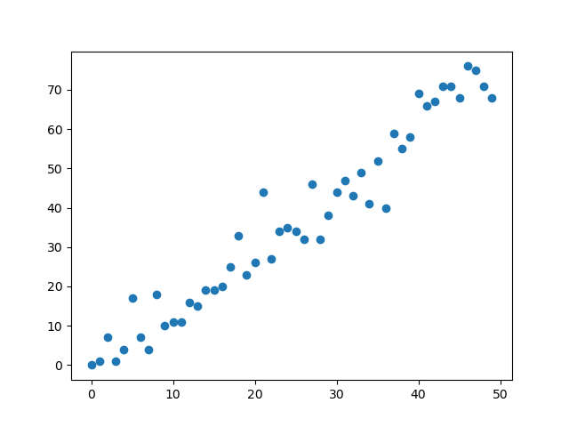
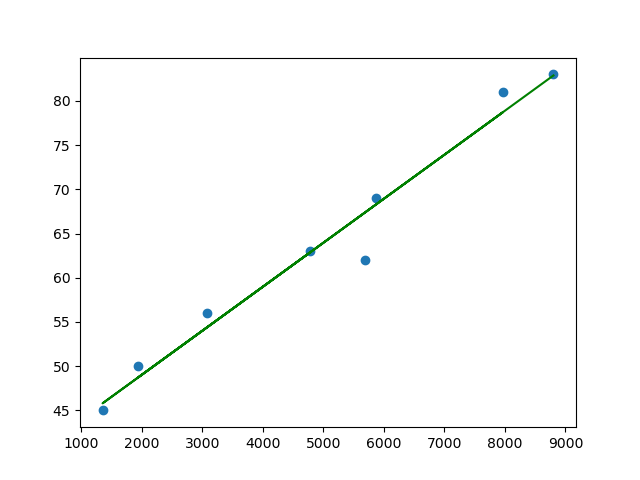

# TD10 : retour du SQL, régression, simulations, suite et fin


{{initexo(0)}}

## 1. Entraînement SQL

!!! abstract "{{ exercice() }}"

    [Lien vers le cours de SQL](https://glassus.github.io/ect2/CoursSQL/langage_SQL/){. target="_blank"}

    **Création de table**
    
    On souhaite créer une table ```tournoi``` concernant les joueurs de rugby du tournoi des VI nations 2023 et leur nombre de points marqués.

    On veut que la table ait la structure suivante :

    - ```id_joueur``` : nombre unique identifiant un joueur (type ```INT```)
    - ```nom``` : nom du joueur (type ```TEXT``` )
    - ```prenom```  : prénom du joueur (type ```TEXT``` )
    - ```équipe```  : nom de l'équipe (type ```TEXT``` )
    - ```points``` : nombre de points marqués (type ```INT``` )

    **Q1.** Quelle sera la clé primaire de cette table ?  

    {{
    correction(True,
    """
    ??? success \"Correction\" 
        La clé primaire de cette table est ```id_joueur``` car c'est un attribut qui identifie de manière unique chaque joueur. 
    """
    )
    }}

      

    **Q2.** Écrire la requête SQL permettant la création de cette table ```tournoi```. 

    {!{ sqlide titre="Votre code SQL :"  base="CoursSQL/data/rugby.db", espace="rugby"}!}

    {{
    correction(True,
    """
    ??? success \"Correction\" 
        ```sql
        CREATE TABLE tournoi (
        id_joueur INTEGER PRIMARY KEY,
        nom TEXT,
        prenom TEXT,
        équipe TEXT,
        points INTEGER
        );
        ```        
    """
    )
    }}


    


    **Q3.** Insérer dans cette table le joueur Finn Russell (Ecosse) qui a marqué 32 points. On lui attribuera un ```id_joueur``` égal à 1. 

    {!{ sqlide titre="Votre code SQL :"  base="CoursSQL/data/rugby.db", espace="rugby"}!}

    {!{ sqlide titre="Vérifiez si la table a bien été modifiée :"  base="CoursSQL/data/rugby.db", espace="rugby"}!}

    {{
    correction(True,
    """
    ??? success \"Correction\" 
        ```sql
        INSERT INTO tournoi
        VALUES (1, 'Russel', 'Finn', 'Ecosse', 32)
        ```        
    """
    )
    }}


    

    **Q4.** Afin de rajouter des joueurs dans cette table, copier-coller le code ci-dessous dans le champ SQL :

    ```sql
    INSERT INTO tournoi
    VALUES 
    (2, "Damian", "Penaud", "France", 25),
    (3, "Tommaso", "Allan", "Italie", 34),
    (4, "Ross", "Byrne", "Irlande", 16),
    (5, "Thomas", "Ramos", "France", 84),
    (6, "Jonathan", "Sexton", "Irlande", 35),
    (7, "Blair", "Kinghorn", "Ecosse", 26),
    (8, "Owen", "Farrell", "Angleterre", 28),
    (9, "Huw", "Jones", "Ecosse", 26);
    ```

    {!{ sqlide titre="Votre code SQL :"  base="CoursSQL/data/rugby.db", espace="rugby"}!}

    {!{ sqlide titre="Vérifiez si la table a bien été modifiée :"  base="CoursSQL/data/rugby.db", espace="rugby"}!}

    Faire une requête pour afficher uniquement le nom et le prénom des joueurs écossais de cette table.

    {!{ sqlide titre="Votre code SQL :"  base="CoursSQL/data/rugby.db", espace="rugby"}!}

    {{
    correction(True,
    """
    ??? success \"Correction\" 
        ```sql
        SELECT nom, prenom
        FROM tournoi
        WHERE équipe = 'Ecosse'
        ```        
    """
    )
    }}


    

    **Q5.** (Hors-Programme) L'instruction ```ORDER BY``` permet de classer les enregistrements d'une table suivant l'ordre (alphabétique, ou numérique) d'un de ses attributs.

    Ainsi la requête
    ```sql
    SELECT *
    FROM tournoi
    ORDER BY nom ASC
    ``` 

    va classer tous les joueurs par ordre alphabétique de leur nom. Si on remplace le ```ASC``` (qui signifie ASCendant) par ```DESC``` (qui signifie DESCendant) on aurait l'ordre inverse.

    Établir le classement des meilleurs marqueurs de points de ce tournoi 2023.  

    !{ sqlide titre="Votre code SQL :"  base="CoursSQL/data/rugby.db", espace="rugby"}!}

    {{
    correction(True,
    """
    ??? success \"Correction\" 
        ```sql
        SELECT *
        FROM tournoi
        ORDER BY points DESC
        ```        
    """
    )
    }}


     

## 2. Retour sur la régression linéaire

!!! note "Coefficient de corrélation linéaire de deux variables aléatoires"
    :arrow_right: **Définition**  
    Le coefficient de corrélation linéaire de deux variables aléatoires $X$ et $Y$ est le réel $\rho(X,Y)$ donné par la formule :
                
    $$\rho(X,Y) = \dfrac{Cov(X,Y)}{\sqrt{V(X)}\sqrt{V(Y)}}$$

    :arrow_right: **Interprétation**   

    - Si $X$ et $Y$ sont indépendantes, alors $\rho(X,Y) = 0$
    - Si $X$ et $Y$ sont liées par une combinaison linéaire (ex : $Y = 3X+2$), alors $\rho(X,Y) = \pm 1$

    :arrow_right: **Utilisation en statistiques**   
    Lorsque $\rho$ est *proche* de 1, on peut conjecturer que le phénomène observé est prédictible. Le tracé de la droite de régression permet alors de faire des prévisions.


!!! note "Syntaxe Python :heart: :heart: :heart:"
    
    :arrow_right: **Calcul du coefficient de corrélation :** ```np.corrcoef(x,y)[0,1]```

    Considérons le code suivant :

    ```python linenums='1'
    import numpy as np
    import matplotlib.pyplot as plt
    plt.clf()

    x = np.array([ 0,  1,  2,  3,  4,  5,  6,  7,  8,  9, 10, 11, 12, 13, 14, 15, 16,
           17, 18, 19, 20, 21, 22, 23, 24, 25, 26, 27, 28, 29, 30, 31, 32, 33,
           34, 35, 36, 37, 38, 39, 40, 41, 42, 43, 44, 45, 46, 47, 48, 49])

    y = np.array([ 0,  1,  7,  1,  4, 17,  7,  4, 18, 10, 11, 11, 16, 15, 19, 19, 20,
           25, 33, 23, 26, 44, 27, 34, 35, 34, 32, 46, 32, 38, 44, 47, 43, 49,
           41, 52, 40, 59, 55, 58, 69, 66, 67, 71, 71, 68, 76, 75, 71, 68])

    coeff = np.corrcoef(x,y)[0,1]

    plt.scatter(x,y)
    print(coeff)

    plt.show()
    ```

    Le tracé laisse apparaître une distribution des points qui semblent être situés autour d'une droite. Ceci est confirmé par le calcul du coefficient de corrélation linéaire (:heart: **calculé par l'instruction** ```np.corrcoef(x,y)[0,1]``` :heart: )

    {: .center}

    :arrow_right: **Calcul et tracé du point moyen :** ```np.mean(x)```

    La fonction ```np.mean(x)``` permet de calculer la valeur moyenne d'un ensemble de valeurs stockées dans la variable ```x```.

    Le point moyen d'une série statistique double peut donc se tracer par :
    ```python
    plt.plot([np.mean(x)], [np.mean(y)], 'r+') 
    ```

    {: .center}


    :arrow_right: **Tracé de la droite de régression :** ```a, b = np.polyfit(x, y, 1)```

    - Le calcul du coefficient directeur ```a``` et de l'ordonnée à l'origine ```b``` de la droite de régression se fait par la commande 
    
    :heart: ```a, b = np.polyfit(x, y, 1)``` :heart:


    - Le tracé de la droite se fait par `plt.plot(x, a*x + b)`


    Insérer les lignes :
    ```python
    a, b = np.polyfit(x, y, 1)
    plt.plot(x, a*x + b, 'g-')
    ```
    dans le code précédent. On obtient alors :
    {: .center}


:arrow_right: [Lien pour ouvrir une console Python dans un nouvel onglet](https://console.basthon.fr/){. target="_blank"}

!!! abstract "{{ exercice() }}"
    *D'après un exercice d'Ana Karina Fermin Rodriguez*

    On étudie pour différents pays le rapport entre le PIB par habitant et le taux de scolarisation (en pourcentage) des moins de 24 ans :

    |Pays | PIB | Taux de scolarisation |
    |:--:|:--:|:--:|
    |Pays en développement| 4775 |63|
    |Pays les plus pauvres |1350 |45|
    |Pays arabes| 5680| 62|
    |Asie de l’Est et Pacifique| 5872| 69|
    |Amérique latine et Caraïbes| 7964| 81|
    |Asie du Sud| 3072 |56|
    |Afrique Sub-saharienne| 1942| 50|
    |Europe centrale, orientale et CEI| 8802| 83| 

    Pour un pays ambitionnant d'avoir un PIB de 7000 $ par habitant, quel devrait être le taux de scolarisation des moins de 24 ans ?

    *Aide à la saisie :*
    ```python
    [4775, 1350, 5680, 5872, 7964, 3072, 1942, 8802]
    [63, 45, 62, 69, 81, 56, 50, 83]
    ```
    
    {{
    correction(True,
    """
    ??? success \"Correction\" 
        ```python linenums='1'
        import numpy as np
        import matplotlib.pyplot as plt

        plt.clf()


        x = np.array([4775, 1350, 5680, 5872, 7964, 3072, 1942, 8802])
        y = np.array([63, 45, 62, 69, 81, 56, 50, 83])


        coeff = np.corrcoef(x, y)[0, 1]

        plt.scatter(x, y)
        print(coeff)

        a, b = np.polyfit(x, y, 1)
        plt.plot(x, a*x + b, 'g-')


        plt.show()

        ```

        {: .center}
        

        ```python
        >>> a
        0.004978235291745592
        >>> b
        39.07172126169925
        >>> a*7000+b
        73.91936830391839
        ```

        On peut estimer à 74 % le taux nécessaire de scolarisation des moins de 24 ans .        
    """
    )
    }}


        
    


## 3. Retour sur les simulations


!!! note ":heart: :heart: :heart: Syntaxe des lois usuelles :heart: :heart: :heart:"
    Rappel : on utilise les simulateurs de lois du module ```random``` de la bibliothèque ```numpy```.  
    Ceci nécessite systématiquement la présence des deux lignes suivantes au début de chaque script :
    ```python linenums='1'
    import numpy as np
    import numpy.random as rd   
    ```  

    - :arrow_right: **loi uniforme** : 
        - ```rd.random()``` renvoie un réel dans $[0;1]$ qui suit une loi uniforme (chaque réel a la même probabilité d'apparition)
        - ```rd.randint(a,b)``` renvoie un entier dans $[a;b[$ qui suit une loi uniforme (chaque entier a la même probabilité d'apparition). Attention, la valeur $b$ n'est pas prise. Ce qui signifie que pour un tirage aléatoire uniforme de 0 et de 1, il faut utiliser l'expression ```rd.randint(0,2)```.

    - :arrow_right: **loi binomiale** : ```rd.binomial(n,p)``` renvoie un entier qui suit une loi binomiale de paramètre $(n,p)$. ($n$ répétitions d'une épreuve de Bernoulli de paramètre $p$)

    - :arrow_right: **loi géométrique** : ```rd.geometric(p)``` renvoie un entier qui suit une loi géométrique de paramètre $p$ (nombre d'expériences de Bernoulli de paramètre $p$ avant l'apparition du premier succès)

    - :arrow_right: **loi exponentielle** : ```rd.exponential(1/lambda)``` renvoie un réel qui suit une loi exponentielle de paramètre ```lambda```.

    - :arrow_right: **loi de Poisson** : ```rd.poisson(lambda)``` renvoie un entier qui suit une loi de Poisson de paramètre ```lambda```.

     - :arrow_right: **loi normale** : ```rd.normal(mu, sigma)``` renvoie un réel qui suit une loi normale de moyenne ```mu``` et de variance ```sigma```$^2$.


    :star: Comment renvoyer un **vecteur** plutôt qu'une seule valeur unique ? Il suffit de rajouter le nombre de simulations désirées comme dernier paramètre dans la parenthèse.

    **Exemple :**  
    Pour simuler 10 tirages aléatoires de nombres égaux à 0 ou à 1, on utilisera :
    ```python
    >>> X = rd.randint(0,2,10)
    >>> X
    array([0, 1, 0, 0, 1, 0, 0, 0, 1, 1])
    ```

    Pour connaître la valeur du 5ème tirage, on appelera :
    ```python
    >>> X[4]
    1
    ```
    :warning: Ne pas oublier qu'on commence à indexer à 0, donc le 5ème élément est l'élément d'indice 4...


   


!!! abstract "{{ exercice() }}"
    
    **Q1.** Écrire une fonction ```tirage``` qui renvoie un nombre entier entre 0 et 10 inclus, suivant une loi uniforme.

    {{
    correction(False,
    """
    ??? success \"Correction\" 
        ```python linenums='1'
        import numpy.random as rd

        def tirage():
            return rd.randint(0,11)
        ```         
    """
    )
    }}
 

    

    **Q2.** Écrire une fonction ```moyenne_tirages``` qui prend pour paramètre un entier ```n``` et qui renvoie la valeur moyenne de la fonction ```tirage``` sur ```n``` tirages.

    {{
    correction(False,
    """
    ??? success \"Correction\" 
        ```python linenums='1'
        def moyenne_tirages(n):
            s = 0
            for _ in range(n):
                s += tirage()
            return s / n
        ```         
    """
    )
    }}


    

    **Q3.** Les instructions ci-dessous permettent de tracer l'histogramme des valeurs que prend ```moyenne_tirages(5)``` lorsqu'on la répète 100 fois.

    ```python linenums='1'
    import numpy as np
    import matplotlib.pyplot as plt
    import numpy.random as rd


    plt.clf()


    def tirage():
        # votre fonction

    def moyenne_tirages(n):
        # votre fonction

    k = 7
    N = 10**2
    x = np.array([moyenne_tirages(k) for n in range(N)])
    plt.hist(x, np.linspace(0, 10, 100), density=True)

    plt.show()
    ``` 

    Faire varier ces paramètres ```k```  et ```N``` , et observer les changements. Quelle est la loi qui est illustrée ici ?

    {{
    correction(False,
    """
    ??? success \"Correction\" 
        Le paramètre ```k``` va influer sur l'écart-type de la gaussienne.
        Plus le paramètre ```N``` sera grand, plus l'histogramme se rapprochera d'une gaussienne.

        Le théorème ici illustré est le Théorème Central Limite.        
    """
    )
    }}


        
    


!!! abstract "{{ exercice() }}"

    Écrire un code où l'utilisateur doit deviner un nombre choisi aléatoirement par l'ordinateur entre 1 et 100. L'utilisateur devra être guidé après chaque proposition par les instructions *«trop grand»* ou *«trop petit»*.

    :material-lifebuoy: *aide :*

    ```python linenums='1'
    import numpy as np
    import numpy.random as rd

    nb_secret = ...

    prop = int(input("proposition ? "))
    while ...
    ```

    {{
    correction(False,
    """
    ??? success \"Correction\" 
        ```python linenums='1'
        import numpy as np
        import numpy.random as rd

        nb_secret = rd.randint(1,101)

        prop = int(input('proposition ? '))
        while prop != nb_secret:
            if prop > nb_secret:
                print('trop grand')
            else:
                print('trop petit')
            prop = int(input('proposition ? '))

        print('bravo !')
        ```
    """
    )
    }}


    


----------

**Bonne chance à tous !**

{: .center}
    