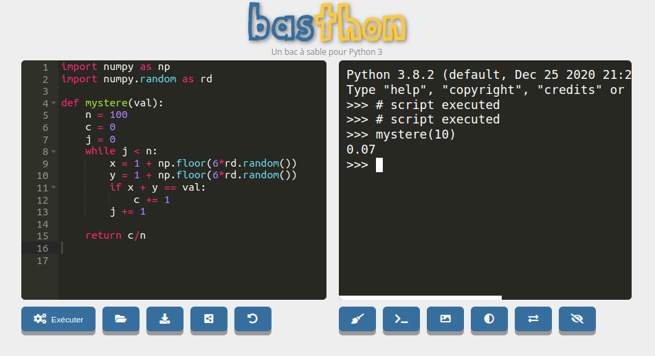

### 1. Séances de Travaux Dirigés

!!! note ":star: Séance en cours :star:"
    - :arrow_right: [TD02](./TD02/TD02/) : premières simulations

!!! note "Séances précédentes"
    - [TD01](./TD01/TD01/) : révision des structures élémentaires

{#
!!! note "Séances précédentes"
    - [TD10](./TD10/TD10/) : retour du SQL, régression, simulations, suite et fin
    - [TD09](./TD09/TD09/) : SQL, régression, simulations
    - [TD08](./TD08/TD08/) : SQL, matrices, régression, simulations
    - [TD07](./TD07/TD07/) : SQL, simulations et dichotomie
    - [TD06](./TD06/TD06/) : lois de probabilités (et la fin du SQL)
    - [TD05](./TD05/TD05/) : SQL 2ème partie, modifications et jointures
    - [TD04](./TD04/TD04/) : découverte du langage SQL
    - [TD03](./TD03/TD03/) : suites et simulations
    - [TD02](./TD02/TD02/) : premières simulations
    - [TD01](./TD01/TD01/) : révision des structures élémentaires

#}
{#
!!! note "Séances précédentes"
    
    - [TD08](./TD08/TD08/) : SQL, matrices, régression, simulations
    - [TD07](./TD07/TD07/) : Suite des lois de probabilités
    - [TD06](./TD06/TD06/) : lois de probabilités (et un soupçon de SQL)
    - [TD05](./TD05/TD05/) : SQL 2ème partie
    - [TD04](./TD04/TD04/) : découverte du langage SQL
    - 
    - 
    - [TD01](./TD01/TD01/) : révision des structures élémentaires df
#}

### 2. L'informatique en ECT
- Vous pouvez retrouver [ici](Programmes/1A/) la partie informatique du programme de mathématiques des deux années d'ECT.

- Vous pouvez retrouver [ici](Memento_Python/commandes/) un rappel de toutes les commandes Python exigibles au concours.
### 3. Python en ligne sans installation
Vous pouvez utiliser l'excellente solution [Basthon](https://console.basthon.fr/){. target="_blank"} :

[{: .center width=60%}](https://console.basthon.fr/){. target="_blank"}

{#

{!{ sqlide titre="Chargement d'une base"  base="livres.db"}!}

test gif anim4

<gif-player src="https://glassus.github.io/terminale_nsi/T2_Programmation/2.2_Recursivite/data/arbre.gif" speed="1" play></gif-player>

## Programmes officiels
### Programme ECT1 - partie informatique
<embed src="https://glassus.github.io/ect2/data/prog1A.pdf" type="application/pdf" width="800px" height="800px"/>
### Programme ECT2 - partie informatique
<embed src="https://glassus.github.io/ect2/data/prog2A.pdf" type="application/pdf" width="800px" height="800px"/>

#}